# 🏢 **PÉRIMÈTRE FONCTIONNEL - API Backend de Gestion de Rendez-vous**

## 🎯 **Vision Métier**

**API Backend Enterprise** complète pour la gestion intelligente des rendez-vous, permettant aux entreprises de **paramétrer leur système calendaire**, **intégrer leur personnel**, et offrir une **expérience client optimale** avec notifications multi-canaux (email/SMS).

## 🏗️ **Architecture Séparée Frontend/Backend**

### 🎨 **Frontend Next.js** (Application Séparée)

- **Site web public** optimisé pour le **référencement SEO**
- **Interface internautes** pour la prise de rendez-vous en ligne
- **Pages statiques générées** pour performances maximales
- **Responsive design** mobile-first
- **Optimisation Core Web Vitals** pour Google
- **Intégration Google Analytics/Tag Manager**
- **Schema.org markup** pour rich snippets
- **Sitemap XML automatique** et robots.txt optimisés

### 🚀 **Backend NestJS** (Ce Projet)

- **API REST pure** avec endpoints sécurisés
- **Gestion métier complète** des rendez-vous
- **Authentification entreprise** et personnel
- **Intégrations tierces** (email, SMS, calendriers)
- **Dashboard administrateur** via API
- **Webhooks** pour synchronisation temps réel
- **Rate limiting** et sécurité enterprise

---

## 🏛️ **Domaines Métier**

### 🏢 **1. Gestion d'Entreprise**

- **Configuration système calendaire**
- **Paramétrage des horaires d'ouverture**
- **Gestion multi-site** (si applicable)
- **Configuration des services proposés**
- **Para ├── enums/
  └── repositories/
  ├── business.repository.ts
  ├── business-location.repository.ts # 🔥 NOUVEAU
  ├── staff.repository.ts
  ├── location-assignment.repository.ts # 🔥 NOUVEAU
  ├── facility.repository.ts # 🔥 NOUVEAU
  ├── appointment.repository.ts
  ├── appointment-group.repository.ts  
   ├── service.repository.ts
  ├── capacity-rule.repository.ts  
   └── notification.repository.ts├── appointment-status.enum.ts
  │ ├── staff-role.enum.ts
  │ ├── notification-channel.enum.ts
  │ ├── notification-event-type.enum.ts
  │ ├── relationship-type.enum.ts # 🔥 NOUVEAU
  │ ├── group-type.enum.ts # 🔥 NOUVEAU
  │ ├── capacity-rule-type.enum.ts # 🔥 NOUVEAU
  │ └── user-role.enum.ts (étendu)e des créneaux disponibles**

### 👥 **2. Gestion du Personnel**

- **Intégration des employés** avec rôles spécialisés
- **Planning individuel** et **disponibilités**
- **Compétences et spécialisations**
- **Gestion des congés et absences**
- **Notifications internes**

### 📅 **3. Système de Rendez-vous**

- **Prise de rendez-vous en ligne** par les clients
- **Validation et confirmation** automatique/manuelle
- **Gestion des créneaux** et **évitement des conflits**
- **Reprogrammation et annulation**
- **Historique des rendez-vous**

### 🌐 **4. Interface Client Public (Frontend Next.js Séparé)**

- **Site web Next.js** optimisé SEO avec référencement naturel
- **Pages statiques générées** pour performances maximales
- **Interface responsive** adaptée mobile et desktop
- **Consommation API REST** sécurisée avec cache intelligent
- **Authentification client** optionnelle via tokens JWT
- **Sélection de services** et **créneaux disponibles** temps réel
- **Informations client** et **préférences** persistées

### 📧 **5. Communication Multi-canaux**

- **Notifications email** automatisées
- **Notifications SMS** (intégration à prévoir)
- **Rappels personnalisables** (J-1, H-2, etc.)
- **Confirmations** et **modifications**

---

## 🎭 **Types d'Utilisateurs**

### 🔴 **1. SUPER_ADMIN** - Propriétaire/Directeur

**Responsabilités :**

- Configuration globale du système calendaire
- Gestion des paramètres d'entreprise
- Supervision de tous les services et personnel
- Accès aux rapports et analyses complètes
- Configuration des notifications et communications

**Permissions étendues :**

```typescript
enum SuperAdminPermission {
  // Configuration Système
  CONFIGURE_BUSINESS_SETTINGS = 'CONFIGURE_BUSINESS_SETTINGS',
  MANAGE_CALENDAR_CONFIG = 'MANAGE_CALENDAR_CONFIG',
  MANAGE_SERVICE_CATALOG = 'MANAGE_SERVICE_CATALOG',
  MANAGE_CAPACITY_RULES = 'MANAGE_CAPACITY_RULES', // 🔥 NOUVEAU

  // Personnel
  MANAGE_ALL_STAFF = 'MANAGE_ALL_STAFF',
  VIEW_ALL_SCHEDULES = 'VIEW_ALL_SCHEDULES',

  // Rendez-vous
  VIEW_ALL_APPOINTMENTS = 'VIEW_ALL_APPOINTMENTS',
  MODIFY_ANY_APPOINTMENT = 'MODIFY_ANY_APPOINTMENT',
  MANAGE_GROUP_BOOKINGS = 'MANAGE_GROUP_BOOKINGS', // 🔥 NOUVEAU
  OVERRIDE_CAPACITY_LIMITS = 'OVERRIDE_CAPACITY_LIMITS', // 🔥 NOUVEAU

  // Réservations Tiers
  VALIDATE_THIRD_PARTY_BOOKINGS = 'VALIDATE_THIRD_PARTY_BOOKINGS', // 🔥 NOUVEAU
  MANAGE_CONSENT_DOCUMENTS = 'MANAGE_CONSENT_DOCUMENTS', // 🔥 NOUVEAU

  // Analytics
  VIEW_BUSINESS_ANALYTICS = 'VIEW_BUSINESS_ANALYTICS',
  VIEW_CAPACITY_ANALYTICS = 'VIEW_CAPACITY_ANALYTICS', // 🔥 NOUVEAU
  EXPORT_DATA = 'EXPORT_DATA',
}
```

### 🟡 **2. MANAGER** - Chef d'équipe/Responsable

**Responsabilités :**

- Gestion de son équipe de personnel
- Validation des rendez-vous de son secteur
- Gestion des plannings de son équipe
- Suivi des performances de son secteur

**Permissions :**

```typescript
enum ManagerPermission {
  // Équipe
  MANAGE_TEAM_STAFF = 'MANAGE_TEAM_STAFF',
  VIEW_TEAM_SCHEDULES = 'VIEW_TEAM_SCHEDULES',
  APPROVE_LEAVE_REQUESTS = 'APPROVE_LEAVE_REQUESTS',

  // Rendez-vous
  VIEW_TEAM_APPOINTMENTS = 'VIEW_TEAM_APPOINTMENTS',
  VALIDATE_APPOINTMENTS = 'VALIDATE_APPOINTMENTS',
  RESCHEDULE_APPOINTMENTS = 'RESCHEDULE_APPOINTMENTS',

  // Rapports
  VIEW_TEAM_REPORTS = 'VIEW_TEAM_REPORTS',
}
```

### 🟢 **3. STAFF** - Personnel/Employé

**Responsabilités :**

- Gestion de son planning personnel
- Prise en charge de ses rendez-vous
- Mise à jour de ses disponibilités
- Communication avec les clients

**Permissions :**

```typescript
enum StaffPermission {
  // Planning personnel
  MANAGE_OWN_SCHEDULE = 'MANAGE_OWN_SCHEDULE',
  SET_AVAILABILITY = 'SET_AVAILABILITY',
  REQUEST_LEAVE = 'REQUEST_LEAVE',

  // Rendez-vous assignés
  VIEW_OWN_APPOINTMENTS = 'VIEW_OWN_APPOINTMENTS',
  CONFIRM_APPOINTMENTS = 'CONFIRM_APPOINTMENTS',
  ADD_APPOINTMENT_NOTES = 'ADD_APPOINTMENT_NOTES',

  // Client
  VIEW_CLIENT_INFO = 'VIEW_CLIENT_INFO',
  COMMUNICATE_WITH_CLIENTS = 'COMMUNICATE_WITH_CLIENTS',
}
```

### 🔵 **4. CLIENT** - Client enregistré

**Responsabilités :**

- Prise de rendez-vous en ligne
- Gestion de ses informations personnelles
- Consultation de son historique
- Réception des notifications

**Permissions :**

```typescript
enum ClientPermission {
  // Rendez-vous personnels
  BOOK_APPOINTMENT = 'BOOK_APPOINTMENT',
  VIEW_OWN_APPOINTMENTS = 'VIEW_OWN_APPOINTMENTS',
  CANCEL_OWN_APPOINTMENTS = 'CANCEL_OWN_APPOINTMENTS',
  RESCHEDULE_OWN_APPOINTMENTS = 'RESCHEDULE_OWN_APPOINTMENTS',

  // Réservations pour tiers 🔥 NOUVEAU
  BOOK_FOR_FAMILY_MEMBER = 'BOOK_FOR_FAMILY_MEMBER',
  BOOK_FOR_CHILD = 'BOOK_FOR_CHILD',
  BOOK_FOR_SPOUSE = 'BOOK_FOR_SPOUSE',
  BOOK_FOR_PARENT = 'BOOK_FOR_PARENT',
  MANAGE_FAMILY_APPOINTMENTS = 'MANAGE_FAMILY_APPOINTMENTS',

  // Réservations de groupe 🔥 NOUVEAU
  BOOK_GROUP_APPOINTMENTS = 'BOOK_GROUP_APPOINTMENTS',
  MANAGE_GROUP_BOOKINGS = 'MANAGE_GROUP_BOOKINGS',

  // Profil
  MANAGE_OWN_PROFILE = 'MANAGE_OWN_PROFILE',
  MANAGE_FAMILY_PROFILES = 'MANAGE_FAMILY_PROFILES', // 🔥 NOUVEAU
  VIEW_APPOINTMENT_HISTORY = 'VIEW_APPOINTMENT_HISTORY',
  SET_NOTIFICATION_PREFERENCES = 'SET_NOTIFICATION_PREFERENCES',

  // Consentements 🔥 NOUVEAU
  GIVE_PARENTAL_CONSENT = 'GIVE_PARENTAL_CONSENT',
  MANAGE_CONSENT_DOCUMENTS = 'MANAGE_CONSENT_DOCUMENTS',
}
```

### ⚪ **5. GUEST** - Internaute non inscrit

**Responsabilités :**

- Consultation des créneaux disponibles
- Prise de rendez-vous ponctuelle
- Réception des notifications de base

**Permissions :**

```typescript
enum GuestPermission {
  VIEW_AVAILABLE_SLOTS = 'VIEW_AVAILABLE_SLOTS',
  BOOK_GUEST_APPOINTMENT = 'BOOK_GUEST_APPOINTMENT',
  VIEW_PUBLIC_SERVICES = 'VIEW_PUBLIC_SERVICES',
}
```

---

## 🏗️ **Spécifications Techniques Frontend/Backend**

### 🎨 **Frontend Next.js - Site Web Public**

#### **🚀 Optimisations SEO & Performances**

```typescript
// Configuration Next.js optimisée
export default {
  // Static Generation pour SEO optimal
  output: 'export', // Pages statiques générées
  trailingSlash: true,

  // Core Web Vitals optimisés
  images: {
    formats: ['image/webp', 'image/avif'],
    loader: 'custom',
    domains: ['api.votre-domaine.com'],
  },

  // Métadonnées SEO dynamiques
  generateMetadata: async ({ params }) => ({
    title: `Prendre RDV - ${business.name} - ${location.name}`,
    description: `Réservez en ligne votre rendez-vous chez ${business.name}. Créneaux disponibles, confirmation immédiate.`,
    keywords: ['rendez-vous', business.name, location.city, ...services],
    openGraph: {
      type: 'website',
      locale: 'fr_FR',
      url: `https://rdv.${business.domain}/${location.slug}`,
      siteName: business.name,
      images: [
        {
          url: business.logoUrl,
          width: 1200,
          height: 630,
          alt: `${business.name} - Prise de rendez-vous`,
        },
      ],
    },
    robots: {
      index: true,
      follow: true,
      googleBot: {
        index: true,
        follow: true,
        'max-video-preview': -1,
        'max-image-preview': 'large',
        'max-snippet': -1,
      },
    },
  }),
};
```

#### **🔍 Schema.org pour Rich Snippets**

```typescript
// JSON-LD pour Google Rich Results
const businessSchema = {
  '@context': 'https://schema.org',
  '@type': 'LocalBusiness',
  name: business.name,
  description: business.description,
  url: `https://rdv.${business.domain}`,
  telephone: business.phone,
  address: {
    '@type': 'PostalAddress',
    streetAddress: location.address.street,
    addressLocality: location.address.city,
    postalCode: location.address.zipCode,
    addressCountry: 'FR',
  },
  geo: {
    '@type': 'GeoCoordinates',
    latitude: location.coordinates.lat,
    longitude: location.coordinates.lng,
  },
  openingHours: location.businessHours.map(
    (schedule) =>
      `${schedule.dayOfWeek} ${schedule.openTime}-${schedule.closeTime}`,
  ),
  hasOfferCatalog: {
    '@type': 'OfferCatalog',
    name: 'Services disponibles',
    itemListElement: services.map((service) => ({
      '@type': 'Offer',
      itemOffered: {
        '@type': 'Service',
        name: service.name,
        description: service.description,
        provider: business.name,
      },
    })),
  },
};
```

#### **📱 Architecture Frontend - Pages Principales**

```typescript
// Structure pages Next.js optimisée SEO
app/
├── layout.tsx                    # Layout global avec GA4
├── page.tsx                      # Landing page entreprise
├── [location]/                   # Pages par site/adresse
│   ├── page.tsx                  # Page site spécifique
│   ├── services/page.tsx         # Liste services du site
│   ├── rdv/                      # Tunnel de réservation
│   │   ├── page.tsx              # Sélection service + créneau
│   │   ├── client/page.tsx       # Infos client
│   │   ├── tiers/page.tsx        # Réservation pour proche
│   │   └── confirmation/page.tsx # Validation réservation
│   └── suivi/                    # Gestion RDV client
│       ├── [token]/page.tsx      # Détails RDV public
│       ├── modifier/page.tsx     # Modification RDV
│       └── annuler/page.tsx      # Annulation RDV
├── sitemap.xml                   # Sitemap automatique
├── robots.txt                    # Robots optimisé
└── api/                          # Routes API internes
    ├── revalidate/               # ISR revalidation
    └── webhook/                  # Webhooks NestJS
```

### 🚀 **Backend NestJS - API Enterprise**

#### **🌐 Endpoints API pour Frontend**

```typescript
// API publique consommée par Next.js
@Controller('public')
export class PublicAppointmentController {
  // Données SEO-friendly avec cache
  @Get('businesses')
  @CacheControl(300) // 5min cache
  async getBusinesses(): Promise<PublicBusinessDto[]> {
    // Données optimisées pour SEO + performance
  }

  @Get('businesses/:id/locations')
  @CacheControl(300)
  async getBusinessLocations(
    @Param('id') businessId: string,
  ): Promise<PublicLocationDto[]> {
    // Sites avec données SEO (coordonnées, horaires, etc.)
  }

  @Get('availability')
  @CacheControl(60) // 1min cache - données temps réel
  async getAvailability(
    @Query() filters: AvailabilityFiltersDto,
  ): Promise<AvailabilityResponseDto> {
    // Créneaux disponibles optimisés
  }

  // Réservation avec validation complète
  @Post('appointments')
  @RateLimit({ ttl: 60, limit: 10 }) // Protection spam
  async createAppointment(
    @Body() data: CreatePublicAppointmentDto,
  ): Promise<PublicAppointmentResponseDto> {
    // Création avec token public pour suivi
  }

  // Gestion RDV client via token public
  @Get('appointments/:token')
  async getAppointmentByToken(
    @Param('token') token: string,
  ): Promise<PublicAppointmentDto> {
    // Accès sécurisé sans auth
  }
}
```

#### **🔄 Synchronisation Temps Réel**

```typescript
// Webhooks pour synchronisation Frontend
@Controller('webhooks')
export class WebhookController {
  @Post('appointment-created')
  async onAppointmentCreated(@Body() data: AppointmentCreatedEvent) {
    // Revalidation ISR Next.js
    await this.nextjsService.revalidate([
      `/api/revalidate?path=/${data.location.slug}`,
      `/api/revalidate?path=/${data.location.slug}/rdv`,
    ]);

    // Notification temps réel clients connectés
    await this.websocketService.emit('availability-updated', {
      locationId: data.locationId,
      serviceId: data.serviceId,
      date: data.appointmentDate,
    });
  }

  @Post('business-updated')
  async onBusinessUpdated(@Body() data: BusinessUpdatedEvent) {
    // Mise à jour cache + revalidation pages
    await this.cacheService.invalidate(`business:${data.businessId}:*`);
    await this.nextjsService.revalidateAll();
  }
}
```

#### **📊 Analytics & SEO Data**

```typescript
// Données analytics pour optimisation SEO
@Controller('admin/seo')
export class SeoAnalyticsController {
  @Get('performance')
  async getSeoPerformance(): Promise<SeoMetricsDto> {
    return {
      // Core Web Vitals depuis Real User Monitoring
      coreWebVitals: await this.analyticsService.getCoreWebVitals(),

      // Positions mots-clés
      keywordRankings: await this.seoService.getKeywordRankings(),

      // Trafic organique
      organicTraffic: await this.analyticsService.getOrganicTraffic(),

      // Taux conversion par landing page
      conversionRates: await this.analyticsService.getConversionRates(),
    };
  }

  @Get('content-optimization')
  async getContentSuggestions(): Promise<ContentOptimizationDto> {
    // Suggestions auto d'optimisation contenu
    return await this.aiService.generateSeoSuggestions({
      businessType: this.business.category,
      location: this.business.locations,
      competitors: await this.seoService.getCompetitors(),
    });
  }
}
```

#### **🎨 Endpoints Gestion Identité d'Entreprise** 🔥 **NOUVEAU**

```typescript
// Gestion de l'identité visuelle et informations d'entreprise
@Controller('admin/business-identity')
@UseGuards(JwtAuthGuard, RoleGuard)
@Roles('SUPER_ADMIN', 'MANAGER')
export class BusinessIdentityController {
  // 🎨 Gestion du branding
  @Put('branding')
  @UseInterceptors(
    FileFieldsInterceptor([
      { name: 'logo', maxCount: 1 },
      { name: 'banner', maxCount: 1 },
      { name: 'profile', maxCount: 1 },
      { name: 'gallery', maxCount: 10 },
    ]),
  )
  async updateBranding(
    @Body() brandingData: UpdateBusinessBrandingDto,
    @UploadedFiles() files: BusinessImageFiles,
    @CurrentUser() user: User,
  ): Promise<BusinessBrandingResponseDto> {
    return await this.businessIdentityService.updateBranding({
      businessId: user.businessId,
      branding: brandingData,
      files,
      requestingUserId: user.id,
    });
  }

  // 📞 Gestion des coordonnées
  @Put('contact-info')
  async updateContactInfo(
    @Body() contactData: UpdateBusinessContactInfoDto,
    @CurrentUser() user: User,
  ): Promise<BusinessContactInfoResponseDto> {
    return await this.businessIdentityService.updateContactInfo({
      businessId: user.businessId,
      contactInfo: contactData,
      requestingUserId: user.id,
    });
  }

  // 📱 Gestion des réseaux sociaux
  @Put('social-media')
  async updateSocialMedia(
    @Body() socialData: UpdateSocialMediaLinksDto,
    @CurrentUser() user: User,
  ): Promise<SocialMediaLinksResponseDto> {
    return await this.businessIdentityService.updateSocialMedia({
      businessId: user.businessId,
      socialMedia: socialData,
      requestingUserId: user.id,
    });
  }

  // 🌐 Profil public avec prévisualisation
  @Get('public-profile/preview')
  async previewPublicProfile(
    @CurrentUser() user: User,
  ): Promise<BusinessPublicProfileResponseDto> {
    return await this.businessIdentityService.getPublicProfile({
      businessId: user.businessId,
      includePrivateInfo: false,
      requestingUserId: user.id,
    });
  }
}

// API publique pour consultation des profils d'entreprise
@Controller('public/business-profile')
export class PublicBusinessProfileController {
  @Get(':businessSlug')
  @CacheControl(300) // 5min cache
  async getPublicBusinessProfile(
    @Param('businessSlug') businessSlug: string,
  ): Promise<PublicBusinessProfileDto> {
    return await this.businessIdentityService.getPublicProfile({
      businessSlug,
      includePrivateInfo: false,
    });
  }

  @Get(':businessSlug/structured-data')
  @CacheControl(3600) // 1h cache - Données Schema.org
  async getStructuredData(
    @Param('businessSlug') businessSlug: string,
  ): Promise<StructuredDataDto> {
    return await this.seoService.generateStructuredData(businessSlug);
  }
}
```

---

## 🏗️ **Entités Métier Principales**

### 🏢 **Business (Entreprise)**

```typescript
export class Business {
  public readonly id: string;
  public readonly name: string;
  public readonly description?: string;
  public readonly slogan?: string; // 🔥 NOUVEAU: Slogan marketing
  public readonly businessSectors: BusinessSector[]; // 🔥 NOUVEAU: Secteurs d'activité
  public readonly branding: BusinessBranding; // 🔥 NOUVEAU: Logo, images, identité visuelle
  public readonly headquarters: Address; // 🔥 MODIFIÉ: Siège social
  public readonly locations: BusinessLocation[]; // 🔥 NOUVEAU: Sites multiples
  public readonly contactInfo: BusinessContactInfo; // 🔥 MODIFIÉ: Coordonnées complètes
  public readonly socialMedia: SocialMediaLinks; // 🔥 NOUVEAU: Réseaux sociaux
  public readonly legalInfo: BusinessLegalInfo; // 🔥 NOUVEAU: Informations légales
  public readonly foundedDate?: Date; // 🔥 NOUVEAU: Date de création
  public readonly globalSettings: BusinessSettings;
  public readonly createdAt: Date;
  public readonly updatedAt: Date;

  // Factory methods
  static create(data: CreateBusinessData): Business;

  // Business rules
  getAllServices(): Service[]; // 🔥 NOUVEAU: Services de tous les sites
  getLocationById(locationId: string): BusinessLocation | null; // 🔥 NOUVEAU
  canOfferServiceAtLocation(serviceId: string, locationId: string): boolean; // 🔥 NOUVEAU
  getAvailableStaffAtLocation(
    locationId: string,
    service: Service,
    dateTime: Date,
  ): Staff[]; // 🔥 NOUVEAU
  hasMultipleLocations(): boolean; // 🔥 NOUVEAU
  updateBranding(branding: BusinessBranding): void; // 🔥 NOUVEAU
  updateContactInfo(contactInfo: BusinessContactInfo): void; // 🔥 NOUVEAU
  updateSocialMedia(socialMedia: SocialMediaLinks): void; // 🔥 NOUVEAU
  getFormattedAddress(): string; // 🔥 NOUVEAU
  getPrimaryContact(): ContactInfo; // 🔥 NOUVEAU
  getPublicProfile(): BusinessPublicProfile; // 🔥 NOUVEAU
}
```

### 🏪 **BusinessLocation (Site/Adresse)** 🔥 **NOUVEAU**

```typescript
export class BusinessLocation {
  public readonly id: string;
  public readonly businessId: string;
  public readonly name: string; // Ex: "Centre-ville", "Succursale Nord"
  public readonly address: Address;
  public readonly contactInfo: ContactInfo;
  public readonly businessHours: BusinessHours[];
  public readonly services: Service[]; // Services spécifiques à ce site
  public readonly facilities: Facility[]; // Équipements du site
  public readonly capacity: LocationCapacity;
  public readonly isActive: boolean;
  public readonly settings: LocationSettings;
  public readonly createdAt: Date;
  public readonly updatedAt: Date;

  // Business rules
  isOpenAt(dateTime: Date): boolean;
  canOfferService(serviceId: string): boolean;
  getAvailableStaff(service: Service, dateTime: Date): Staff[];
  calculateDistanceFrom(otherLocation: BusinessLocation): number;
  shareStaffWith(otherLocation: BusinessLocation): boolean;
  hasCapacityFor(service: Service, groupSize: number): boolean;
}
```

### 👤 **Staff (Personnel)**

```typescript
export class Staff {
  public readonly id: string;
  public readonly userId: string; // Référence vers User
  public readonly businessId: string;
  public readonly primaryLocationId: string; // 🔥 NOUVEAU: Site principal
  public readonly assignedLocations: LocationAssignment[]; // 🔥 NOUVEAU: Sites assignés
  public readonly role: StaffRole;
  public readonly specializations: Service[];
  public readonly isActive: boolean;
  public readonly hireDate: Date;

  // Business rules
  isAvailableAt(dateTime: Date, locationId?: string): boolean; // 🔥 MODIFIÉ
  canProvideService(serviceId: string, locationId?: string): boolean; // 🔥 MODIFIÉ
  getWorkingHoursForDay(
    day: DayOfWeek,
    locationId: string,
  ): WorkingHours | null; // 🔥 MODIFIÉ
  isAssignedToLocation(locationId: string): boolean; // 🔥 NOUVEAU
  canWorkAtLocation(locationId: string, dateTime: Date): boolean; // 🔥 NOUVEAU
  getTravelTimeBetweenLocations(
    fromLocation: string,
    toLocation: string,
  ): number; // 🔥 NOUVEAU
  getLocationPriority(locationId: string): number; // 🔥 NOUVEAU
}
```

### 📍 **LocationAssignment (Affectation Site)** 🔥 **NOUVEAU**

```typescript
export class LocationAssignment {
  public readonly id: string;
  public readonly staffId: string;
  public readonly locationId: string;
  public readonly workingHours: WorkingHours[];
  public readonly priority: number; // 1=principal, 2=secondaire, etc.
  public readonly maxHoursPerWeek: number;
  public readonly startDate: Date;
  public readonly endDate?: Date;
  public readonly restrictions?: LocationRestriction[];
  public readonly isActive: boolean;

  // Business rules
  isActiveOn(date: Date): boolean;
  canWorkHours(hours: number): boolean;
  getAvailableHoursForWeek(weekStart: Date): number;
  hasRestrictionFor(serviceId: string): boolean;
}
```

### 🏗️ **Facility (Équipement/Salle)** 🔥 **NOUVEAU**

```typescript
export class Facility {
  public readonly id: string;
  public readonly locationId: string;
  public readonly name: string;
  public readonly type: FacilityType;
  public readonly capacity: number;
  public readonly equipment: Equipment[];
  public readonly suitableServices: string[]; // ServiceIds
  public readonly bookingRules: FacilityBookingRule[];
  public readonly isActive: boolean;

  // Business rules
  isAvailableAt(dateTime: Date, duration: number): boolean;
  canAccommodateService(service: Service): boolean;
  calculateOptimalCapacity(service: Service): number;
  hasRequiredEquipment(requirements: EquipmentRequirement[]): boolean;
}
```

### 📅 **Appointment (Rendez-vous)**

```typescript
export class Appointment {
  public readonly id: string;
  public readonly businessId: string;
  public readonly locationId: string; // 🔥 NOUVEAU: Site du RDV
  public readonly serviceId: string;
  public readonly staffId: string;
  public readonly facilityId?: string; // 🔥 NOUVEAU: Salle/Équipement utilisé
  public readonly clientId?: string; // Optional pour les guests
  public readonly bookedBy: ClientInfo; // Qui a réservé
  public readonly beneficiary: BeneficiaryInfo; // Bénéficiaire du RDV
  public readonly relationship?: RelationshipType; // Relation
  public readonly groupSize: number; // Nombre de personnes
  public readonly additionalBeneficiaries?: BeneficiaryInfo[]; // RDV groupe
  public readonly scheduledAt: Date;
  public readonly duration: number; // en minutes
  public readonly status: AppointmentStatus;
  public readonly notes?: string;
  public readonly consentGiven: boolean; // Consentement pour tiers
  public readonly travelTimeBuffer?: number; // 🔥 NOUVEAU: Temps de trajet staff
  public readonly createdAt: Date;
  public readonly updatedAt: Date;

  // Business rules
  canBeRescheduled(): boolean;
  canBeCancelled(): boolean;
  isUpcoming(): boolean;
  requiresConfirmation(): boolean;
  isBookedForSelf(): boolean;
  requiresParentalConsent(): boolean;
  canBookerModify(): boolean;
  getLocation(): BusinessLocation; // 🔥 NOUVEAU
  requiresFacility(): boolean; // 🔥 NOUVEAU
  canStaffTravelInTime(previousAppointment?: Appointment): boolean; // 🔥 NOUVEAU
}
```

### 🛎️ **Service**

```typescript
export class Service {
  public readonly id: string;
  public readonly businessId: string;
  public readonly availableLocations: string[]; // 🔥 NOUVEAU: Sites où le service est disponible
  public readonly name: string;
  public readonly description: string;
  public readonly duration: number; // en minutes
  public readonly price: Money;
  public readonly locationSpecificPricing: Map<string, Money>; // 🔥 NOUVEAU: Prix par site
  public readonly requiresStaffSpecialization: boolean;
  public readonly maxConcurrentCapacity: number;
  public readonly allowsGroupBooking: boolean;
  public readonly maxGroupSize: number;
  public readonly facilityRequirements: FacilityRequirement[]; // 🔥 NOUVEAU
  public readonly isActive: boolean;
  public readonly settings: ServiceSettings;

  // Business rules
  calculateEndTime(startTime: Date): Date;
  isAvailableForBooking(): boolean;
  isAvailableAtLocation(locationId: string): boolean; // 🔥 NOUVEAU
  getQualifiedStaffAtLocation(locationId: string): Staff[]; // 🔥 NOUVEAU
  getPriceForLocation(locationId: string): Money; // 🔥 NOUVEAU
  canAccommodateAdditionalBooking(currentBookings: number): boolean;
  calculateAvailableCapacity(currentBookings: number): number;
  requiresFacilityType(facilityType: FacilityType): boolean; // 🔥 NOUVEAU
}
```

### 🕒 **TimeSlot (Créneau)**

```typescript
export class TimeSlot {
  public readonly startTime: Date;
  public readonly endTime: Date;
  public readonly staffId: string;
  public readonly serviceId: string;
  public readonly currentCapacity: number; // 🔥 NOUVEAU: Capacité utilisée
  public readonly maxCapacity: number; // 🔥 NOUVEAU: Capacité maximale
  public readonly isAvailable: boolean;
  public readonly appointmentIds: string[]; // 🔥 NOUVEAU: Liste des RDV (au lieu d'un seul)

  // Business rules
  overlaps(other: TimeSlot): boolean;
  canAccommodateService(service: Service): boolean;
  canAccommodateAdditionalBooking(groupSize: number): boolean; // 🔥 NOUVEAU
  getRemainingCapacity(): number; // 🔥 NOUVEAU
  getDuration(): number;
  isFull(): boolean; // 🔥 NOUVEAU
}
```

### 📞 **NotificationPreference**

```typescript
export class NotificationPreference {
  public readonly clientId: string;
  public readonly emailEnabled: boolean;
  public readonly smsEnabled: boolean;
  public readonly reminderSettings: ReminderSettings;
  public readonly channels: NotificationChannel[];

  // Business rules
  shouldSendEmail(eventType: NotificationEventType): boolean;
  shouldSendSMS(eventType: NotificationEventType): boolean;
  getReminderTiming(eventType: NotificationEventType): number[];
}
```

### 👥 **BeneficiaryInfo (Bénéficiaire)**

```typescript
export class BeneficiaryInfo {
  public readonly firstName: string;
  public readonly lastName: string;
  public readonly email?: string;
  public readonly phone?: string;
  public readonly dateOfBirth?: Date;
  public readonly gender?: Gender;
  public readonly relationship: RelationshipType;
  public readonly emergencyContact?: ContactInfo;
  public readonly medicalNotes?: string; // Pour certains services
  public readonly preferredLanguage: string;

  // Business rules
  getAge(): number;
  isMinor(): boolean;
  requiresParentalConsent(): boolean;
  canReceiveDirectNotifications(): boolean;
}
```

### 🔗 **AppointmentGroup (Groupe de RDV)**

```typescript
export class AppointmentGroup {
  public readonly id: string;
  public readonly mainAppointmentId: string;
  public readonly groupType: GroupType; // FAMILY, TEAM, COUPLE, etc.
  public readonly appointments: Appointment[];
  public readonly bookedBy: ClientInfo;
  public readonly totalSize: number;
  public readonly discountApplied?: Money;
  public readonly specialRequests?: string;
  public readonly createdAt: Date;

  // Business rules
  calculateTotalPrice(): Money;
  canAllBeCancelledTogether(): boolean;
  requiresGroupConfirmation(): boolean;
  hasMinorBeneficiaries(): boolean;
}
```

### 📊 **CapacityRule (Règle de Capacité)**

```typescript
export class CapacityRule {
  public readonly serviceId: string;
  public readonly timeOfDay: TimeRange;
  public readonly dayOfWeek: DayOfWeek[];
  public readonly maxConcurrentAppointments: number;
  public readonly staffRequirement: StaffRequirement;
  public readonly roomRequirement?: RoomRequirement;
  public readonly isActive: boolean;

  // Business rules
  appliesTo(dateTime: Date): boolean;
  calculateRequiredStaff(currentBookings: number): number;
  canAccommodateBooking(currentLoad: CapacityLoad): boolean;
}
```

---

## � **Énumérations et Types Spécialisés** 🔥 **NOUVEAU**

### **RelationshipType** - Types de Relations

```typescript
export enum RelationshipType {
  SELF = 'SELF', // Pour soi-même
  SPOUSE = 'SPOUSE', // Conjoint(e)
  CHILD = 'CHILD', // Enfant
  PARENT = 'PARENT', // Parent
  SIBLING = 'SIBLING', // Frère/Sœur
  GRANDPARENT = 'GRANDPARENT', // Grand-parent
  GRANDCHILD = 'GRANDCHILD', // Petit-enfant
  LEGAL_GUARDIAN = 'LEGAL_GUARDIAN', // Tuteur légal
  FRIEND = 'FRIEND', // Ami(e)
  COLLEAGUE = 'COLLEAGUE', // Collègue
  OTHER = 'OTHER', // Autre relation
}
```

### **GroupType** - Types de Groupe

```typescript
export enum GroupType {
  FAMILY = 'FAMILY', // Famille
  COUPLE = 'COUPLE', // Couple
  FRIENDS = 'FRIENDS', // Amis
  COLLEAGUES = 'COLLEAGUES', // Collègues
  TEAM = 'TEAM', // Équipe
  CLASS = 'CLASS', // Classe/Groupe d'étude
  CORPORATE = 'CORPORATE', // Groupe d'entreprise
  OTHER = 'OTHER', // Autre type
}
```

### **ConsentType** - Types de Consentement

```typescript
export enum ConsentType {
  PARENTAL = 'PARENTAL', // Consentement parental
  MEDICAL = 'MEDICAL', // Consentement médical
  DATA_PROCESSING = 'DATA_PROCESSING', // Traitement des données
  EMERGENCY_CONTACT = 'EMERGENCY_CONTACT', // Contact d'urgence
  PHOTO_VIDEO = 'PHOTO_VIDEO', // Photos/Vidéos
  THIRD_PARTY_BOOKING = 'THIRD_PARTY_BOOKING', // Réservation par tiers
}
```

### **CapacityRuleType** - Types de Règles de Capacité

```typescript
export enum CapacityRuleType {
  FIXED_CAPACITY = 'FIXED_CAPACITY', // Capacité fixe
  STAFF_RATIO = 'STAFF_RATIO', // Ratio staff/clients
  ROOM_CAPACITY = 'ROOM_CAPACITY', // Capacité de salle
  EQUIPMENT_LIMIT = 'EQUIPMENT_LIMIT', // Limite d'équipement
  TIME_BASED = 'TIME_BASED', // Basé sur l'heure
  DAY_BASED = 'DAY_BASED', // Basé sur le jour
  SEASONAL = 'SEASONAL', // Saisonnier
}
```

### **BookingChannel** - Canaux de Réservation

```typescript
export enum BookingChannel {
  ONLINE_PORTAL = 'ONLINE_PORTAL', // Portail en ligne
  MOBILE_APP = 'MOBILE_APP', // Application mobile
  PHONE_CALL = 'PHONE_CALL', // Appel téléphonique
  WALK_IN = 'WALK_IN', // Sur place
  STAFF_BOOKING = 'STAFF_BOOKING', // Réservé par le personnel
  PARTNER_API = 'PARTNER_API', // API partenaire
}
```

### **FacilityType** - Types d'Équipements 🔥 **NOUVEAU**

```typescript
export enum FacilityType {
  CONSULTATION_ROOM = 'CONSULTATION_ROOM', // Salle de consultation
  TREATMENT_ROOM = 'TREATMENT_ROOM', // Salle de traitement
  GROUP_ROOM = 'GROUP_ROOM', // Salle de groupe
  MEETING_ROOM = 'MEETING_ROOM', // Salle de réunion
  EQUIPMENT_STATION = 'EQUIPMENT_STATION', // Poste d'équipement
  WAITING_AREA = 'WAITING_AREA', // Zone d'attente
  RECEPTION = 'RECEPTION', // Réception
  LABORATORY = 'LABORATORY', // Laboratoire
  WORKSHOP = 'WORKSHOP', // Atelier
  OUTDOOR_SPACE = 'OUTDOOR_SPACE', // Espace extérieur
}
```

### **LocationRestriction** - Restrictions par Site 🔥 **NOUVEAU**

```typescript
export enum LocationRestriction {
  TIME_LIMITED = 'TIME_LIMITED', // Temps limité
  SERVICE_SPECIFIC = 'SERVICE_SPECIFIC', // Services spécifiques
  SENIORITY_REQUIRED = 'SENIORITY_REQUIRED', // Ancienneté requise
  CERTIFICATION_REQUIRED = 'CERTIFICATION_REQUIRED', // Certification
  MANAGER_APPROVAL = 'MANAGER_APPROVAL', // Approbation manager
  PEAK_HOURS_ONLY = 'PEAK_HOURS_ONLY', // Heures de pointe uniquement
  OFF_PEAK_ONLY = 'OFF_PEAK_ONLY', // Heures creuses uniquement
}
```

### **StaffMobilityType** - Types de Mobilité Staff 🔥 **NOUVEAU**

```typescript
export enum StaffMobilityType {
  FIXED_LOCATION = 'FIXED_LOCATION', // Site fixe uniquement
  MULTI_LOCATION = 'MULTI_LOCATION', // Multi-sites
  MOBILE = 'MOBILE', // Mobile (domicile, etc.)
  ON_DEMAND = 'ON_DEMAND', // À la demande
  ROTATING = 'ROTATING', // Rotation planifiée
}
```

---

## 🏢 **Entités Métier pour Informations d'Entreprise** 🔥 **NOUVEAU**

### 🎨 **BusinessBranding (Identité Visuelle)**

```typescript
export class BusinessBranding {
  public readonly logoUrl: string; // Logo principal
  public readonly logoLightUrl?: string; // Logo version claire
  public readonly logoDarkUrl?: string; // Logo version sombre
  public readonly faviconUrl?: string; // Favicon
  public readonly bannerImageUrl?: string; // Image de bannière
  public readonly profileImageUrl?: string; // Photo de profil
  public readonly brandColors: BrandColors; // Couleurs de marque
  public readonly brandFonts?: BrandFonts; // Polices de marque
  public readonly brandGuidelines?: string; // Guidelines de marque
  public readonly imageGallery: BusinessImage[]; // Galerie d'images
  public readonly updatedAt: Date;

  // Business rules
  getLogoForTheme(theme: 'light' | 'dark'): string;
  getPrimaryColor(): string;
  getSecondaryColor(): string;
  validateImageFormats(): boolean;
  optimizeImagesForWeb(): Promise<OptimizedImages>;
}
```

### 🎨 **BrandColors (Couleurs de Marque)**

```typescript
export class BrandColors {
  public readonly primary: string; // Couleur principale (#hex)
  public readonly secondary?: string; // Couleur secondaire
  public readonly accent?: string; // Couleur d'accent
  public readonly background?: string; // Couleur de fond
  public readonly text?: string; // Couleur de texte
  public readonly neutral?: string; // Couleur neutre

  // Business rules
  isValidHexColor(color: string): boolean;
  getColorPalette(): ColorPalette;
  generateComplementaryColors(): ComplementaryColors;
}
```

### 📷 **BusinessImage (Images d'Entreprise)**

```typescript
export class BusinessImage {
  public readonly id: string;
  public readonly url: string;
  public readonly alt: string; // Texte alternatif
  public readonly caption?: string; // Légende
  public readonly category: ImageCategory; // Catégorie d'image
  public readonly size: ImageSize; // Dimensions
  public readonly format: ImageFormat; // Format (jpg, png, webp)
  public readonly isPublic: boolean; // Visible publiquement
  public readonly order: number; // Ordre d'affichage
  public readonly uploadedAt: Date;
  public readonly updatedAt: Date;

  // Business rules
  isOptimizedForWeb(): boolean;
  generateThumbnail(): Promise<string>;
  compressImage(quality: number): Promise<CompressedImage>;
}
```

### 📞 **BusinessContactInfo (Coordonnées d'Entreprise)**

```typescript
export class BusinessContactInfo {
  public readonly primaryPhone: string; // Téléphone principal
  public readonly secondaryPhone?: string; // Téléphone secondaire
  public readonly mobilePhone?: string; // Mobile
  public readonly faxNumber?: string; // Fax
  public readonly primaryEmail: string; // Email principal
  public readonly supportEmail?: string; // Email support
  public readonly salesEmail?: string; // Email commercial
  public readonly websiteUrl?: string; // Site web
  public readonly emergencyContact?: EmergencyContactInfo; // Contact d'urgence
  public readonly businessHours: ContactBusinessHours; // Horaires de contact
  public readonly preferredContactMethods: ContactMethod[]; // Méthodes préférées
  public readonly languages: SupportedLanguage[]; // Langues supportées
  public readonly updatedAt: Date;

  // Business rules
  getPrimaryContact(): ContactInfo;
  getContactByType(type: ContactType): ContactInfo | null;
  isContactMethodAvailable(method: ContactMethod, dateTime: Date): boolean;
  formatPhoneNumber(country: string): string;
  validateEmailAddresses(): ValidationResult;
}
```

### 📱 **SocialMediaLinks (Réseaux Sociaux)**

```typescript
export class SocialMediaLinks {
  public readonly facebook?: SocialMediaProfile;
  public readonly instagram?: SocialMediaProfile;
  public readonly twitter?: SocialMediaProfile;
  public readonly linkedin?: SocialMediaProfile;
  public readonly youtube?: SocialMediaProfile;
  public readonly tiktok?: SocialMediaProfile;
  public readonly pinterest?: SocialMediaProfile;
  public readonly whatsapp?: string; // Numéro WhatsApp Business
  public readonly telegram?: string; // Canal Telegram
  public readonly customLinks?: CustomSocialLink[]; // Liens personnalisés
  public readonly updatedAt: Date;

  // Business rules
  getActiveProfiles(): SocialMediaProfile[];
  validateSocialUrls(): ValidationResult;
  generateSocialSharingUrls(content: ShareableContent): SocialSharingUrls;
  getFollowersCount(): Promise<SocialMetrics>;
}
```

### 📱 **SocialMediaProfile (Profil Réseau Social)**

```typescript
export class SocialMediaProfile {
  public readonly platform: SocialPlatform;
  public readonly url: string;
  public readonly username: string;
  public readonly displayName?: string;
  public readonly isVerified: boolean;
  public readonly isActive: boolean;
  public readonly followersCount?: number;
  public readonly lastUpdated?: Date;

  // Business rules
  isValidUrl(): boolean;
  generateEmbedCode(): string;
  getProfileMetrics(): Promise<ProfileMetrics>;
}
```

### 🏭 **BusinessSector (Secteur d'Activité)**

```typescript
export class BusinessSector {
  public readonly id: string;
  public readonly name: string; // Ex: "Santé et Bien-être"
  public readonly code: string; // Code NAF/NACE
  public readonly description?: string;
  public readonly category: SectorCategory; // Catégorie principale
  public readonly subcategories: string[]; // Sous-catégories
  public readonly keywords: string[]; // Mots-clés SEO
  public readonly regulations?: BusinessRegulation[]; // Réglementations spécifiques
  public readonly isActive: boolean;

  // Business rules
  getRegulationsByType(type: RegulationType): BusinessRegulation[];
  generateSeoKeywords(): string[];
  isRegulatedSector(): boolean;
}
```

### ⚖️ **BusinessLegalInfo (Informations Légales)**

```typescript
export class BusinessLegalInfo {
  public readonly legalName: string; // Raison sociale
  public readonly tradingName?: string; // Nom commercial
  public readonly legalForm: CompanyType; // Forme juridique (SARL, SAS, etc.)
  public readonly registrationNumber: string; // SIRET
  public readonly vatNumber?: string; // TVA intracommunautaire
  public readonly tradeRegisterNumber?: string; // RCS
  public readonly licenseNumbers: BusinessLicense[]; // Licences professionnelles
  public readonly insuranceInfo?: InsuranceInfo; // Assurances
  public readonly complianceCertifications: ComplianceCertification[]; // Certifications
  public readonly establishmentDate: Date; // Date d'établissement
  public readonly updatedAt: Date;

  // Business rules
  isLicenseValid(licenseType: LicenseType): boolean;
  getActiveCertifications(): ComplianceCertification[];
  generateLegalDisclaimer(): string;
  validateComplianceStatus(): ComplianceStatus;
}
```

### 📄 **BusinessPublicProfile (Profil Public)**

```typescript
export class BusinessPublicProfile {
  public readonly businessId: string;
  public readonly displayName: string;
  public readonly shortDescription: string; // Description courte (160 chars max)
  public readonly longDescription?: string; // Description détaillée
  public readonly tagline?: string; // Phrase d'accroche
  public readonly highlights: string[]; // Points forts
  public readonly awards?: BusinessAward[]; // Récompenses
  public readonly testimonials?: CustomerTestimonial[]; // Témoignages
  public readonly featuredServices: string[]; // Services mis en avant
  public readonly galleryImages: string[]; // Images de galerie
  public readonly videoUrl?: string; // Vidéo de présentation
  public readonly isPubliclyVisible: boolean;
  public readonly seoMetadata: SeoMetadata; // Métadonnées SEO
  public readonly updatedAt: Date;

  // Business rules
  generateMetaDescription(): string;
  getStructuredData(): StructuredData; // Schema.org
  optimizeForSeo(): SeoOptimization;
  validatePublicContent(): ContentValidation;
}
```

---

## 📝 **Énumérations pour Informations d'Entreprise** 🔥 **NOUVEAU**

### **ImageCategory** - Catégories d'Images

```typescript
export enum ImageCategory {
  LOGO = 'LOGO',
  BANNER = 'BANNER',
  GALLERY = 'GALLERY',
  TEAM = 'TEAM',
  FACILITY = 'FACILITY',
  SERVICE = 'SERVICE',
  CERTIFICATE = 'CERTIFICATE',
  PRODUCT = 'PRODUCT',
  EVENT = 'EVENT',
  OTHER = 'OTHER',
}
```

### **SocialPlatform** - Plateformes Sociales

```typescript
export enum SocialPlatform {
  FACEBOOK = 'FACEBOOK',
  INSTAGRAM = 'INSTAGRAM',
  TWITTER = 'TWITTER',
  LINKEDIN = 'LINKEDIN',
  YOUTUBE = 'YOUTUBE',
  TIKTOK = 'TIKTOK',
  PINTEREST = 'PINTEREST',
  SNAPCHAT = 'SNAPCHAT',
  WHATSAPP = 'WHATSAPP',
  TELEGRAM = 'TELEGRAM',
  CUSTOM = 'CUSTOM',
}
```

### **ContactMethod** - Méthodes de Contact

```typescript
export enum ContactMethod {
  PHONE = 'PHONE',
  EMAIL = 'EMAIL',
  SMS = 'SMS',
  WHATSAPP = 'WHATSAPP',
  ONLINE_CHAT = 'ONLINE_CHAT',
  CONTACT_FORM = 'CONTACT_FORM',
  APPOINTMENT_BOOKING = 'APPOINTMENT_BOOKING',
  SOCIAL_MEDIA = 'SOCIAL_MEDIA',
}
```

### **SectorCategory** - Catégories de Secteurs

```typescript
export enum SectorCategory {
  HEALTHCARE = 'HEALTHCARE', // Santé
  BEAUTY_WELLNESS = 'BEAUTY_WELLNESS', // Beauté et bien-être
  PROFESSIONAL_SERVICES = 'PROFESSIONAL_SERVICES', // Services professionnels
  EDUCATION = 'EDUCATION', // Éducation
  CONSULTING = 'CONSULTING', // Conseil
  MAINTENANCE = 'MAINTENANCE', // Maintenance
  PERSONAL_SERVICES = 'PERSONAL_SERVICES', // Services à la personne
  AUTOMOTIVE = 'AUTOMOTIVE', // Automobile
  HOME_SERVICES = 'HOME_SERVICES', // Services à domicile
  OTHER = 'OTHER', // Autre
}
```

### **CompanyType** - Formes Juridiques

```typescript
export enum CompanyType {
  SARL = 'SARL', // Société à responsabilité limitée
  SAS = 'SAS', // Société par actions simplifiée
  SA = 'SA', // Société anonyme
  EURL = 'EURL', // Entreprise unipersonnelle à responsabilité limitée
  SNC = 'SNC', // Société en nom collectif
  MICRO_ENTREPRISE = 'MICRO_ENTREPRISE', // Micro-entreprise
  EI = 'EI', // Entreprise individuelle
  ASSOCIATION = 'ASSOCIATION', // Association
  OTHER = 'OTHER', // Autre
}
```

---

## �🔄 **Use Cases Principaux**

### 🏢 **Gestion d'Entreprise**

#### **ConfigureBusinessUseCase**

```typescript
export interface ConfigureBusinessRequest {
  businessId: string;
  settings: BusinessSettingsData;
  locations?: BusinessLocationData[]; // 🔥 NOUVEAU: Configuration des sites
  requestingUserId: string;
}

export class ConfigureBusinessUseCase {
  async execute(request: ConfigureBusinessRequest): Promise<BusinessResponse>;
}
```

#### **ManageLocationUseCase** 🔥 **NOUVEAU**

```typescript
export interface ManageLocationRequest {
  businessId: string;
  locationData: BusinessLocationData;
  operation: 'CREATE' | 'UPDATE' | 'DELETE' | 'ACTIVATE' | 'DEACTIVATE';
  requestingUserId: string;
}

export class ManageLocationUseCase {
  async execute(request: ManageLocationRequest): Promise<LocationResponse>;

  private validateLocationData(data: BusinessLocationData): Promise<void>;
  private checkStaffReassignmentNeeded(locationId: string): Promise<void>;
  private migrateAppointments(
    fromLocationId: string,
    toLocationId: string,
  ): Promise<void>;
  private updateLocationCapacityRules(
    location: BusinessLocation,
  ): Promise<void>;
}
```

#### **ManageServicesUseCase**

```typescript
export interface ManageServiceRequest {
  businessId: string;
  serviceData: ServiceData;
  operation: 'CREATE' | 'UPDATE' | 'DELETE';
  requestingUserId: string;
}

export class ManageServicesUseCase {
  async execute(request: ManageServiceRequest): Promise<ServiceResponse>;
}
```

### 👥 **Gestion du Personnel**

#### **ManageStaffUseCase**

```typescript
export interface ManageStaffRequest {
  businessId: string;
  staffData: StaffData;
  locationAssignments: LocationAssignmentData[]; // 🔥 NOUVEAU: Affectations sites
  operation: 'HIRE' | 'UPDATE' | 'TERMINATE' | 'REASSIGN';
  requestingUserId: string;
}

export class ManageStaffUseCase {
  async execute(request: ManageStaffRequest): Promise<StaffResponse>;
}
```

#### **AssignStaffToLocationUseCase** 🔥 **NOUVEAU**

```typescript
export interface AssignStaffToLocationRequest {
  staffId: string;
  locationId: string;
  workingHours: WorkingHoursData[];
  priority: number;
  maxHoursPerWeek: number;
  startDate: Date;
  endDate?: Date;
  restrictions?: LocationRestriction[];
  requestingUserId: string;
}

export class AssignStaffToLocationUseCase {
  async execute(
    request: AssignStaffToLocationRequest,
  ): Promise<StaffAssignmentResponse>;

  private validateLocationAccess(
    staffId: string,
    locationId: string,
  ): Promise<void>;
  private checkSchedulingConflicts(
    assignment: LocationAssignmentData,
  ): Promise<void>;
  private calculateOptimalSchedule(
    staff: Staff,
    locations: BusinessLocation[],
  ): Promise<Schedule>;
  private updateStaffCapacityAtLocations(staffId: string): Promise<void>;
}
```

#### **SetStaffAvailabilityUseCase**

```typescript
export interface SetAvailabilityRequest {
  staffId: string;
  workingHours: WorkingHoursData[];
  effectiveDate: Date;
  requestingUserId: string;
}

export class SetStaffAvailabilityUseCase {
  async execute(request: SetAvailabilityRequest): Promise<AvailabilityResponse>;
}
```

### 🎨 **Gestion de l'Identité d'Entreprise** 🔥 **NOUVEAU**

#### **UpdateBusinessBrandingUseCase**

```typescript
export interface UpdateBusinessBrandingRequest {
  businessId: string;
  branding: BusinessBrandingData;
  requestingUserId: string;
}

export interface BusinessBrandingData {
  logoFile?: FileUpload; // Nouveau logo
  bannerImageFile?: FileUpload; // Nouvelle bannière
  profileImageFile?: FileUpload; // Nouvelle image de profil
  brandColors?: BrandColorsData;
  brandFonts?: BrandFontsData;
  imageGallery?: BusinessImageData[];
  removeImages?: string[]; // IDs des images à supprimer
}

export class UpdateBusinessBrandingUseCase {
  async execute(
    request: UpdateBusinessBrandingRequest,
  ): Promise<BrandingResponse>;

  private validateImageFormats(files: FileUpload[]): Promise<void>;
  private optimizeImagesForWeb(files: FileUpload[]): Promise<OptimizedImage[]>;
  private generateImageVariants(image: OptimizedImage): Promise<ImageVariants>;
  private updateBrandingAssets(branding: BusinessBrandingData): Promise<void>;
  private generateBrandGuidelines(colors: BrandColors): Promise<string>;
  private notifyBrandingUpdate(businessId: string): Promise<void>;
}
```

#### **UpdateBusinessContactInfoUseCase**

```typescript
export interface UpdateBusinessContactInfoRequest {
  businessId: string;
  contactInfo: BusinessContactInfoData;
  requestingUserId: string;
}

export interface BusinessContactInfoData {
  primaryPhone: string;
  secondaryPhone?: string;
  mobilePhone?: string;
  faxNumber?: string;
  primaryEmail: string;
  supportEmail?: string;
  salesEmail?: string;
  websiteUrl?: string;
  emergencyContact?: EmergencyContactInfoData;
  businessHours?: ContactBusinessHoursData;
  preferredContactMethods?: ContactMethod[];
  languages?: SupportedLanguage[];
}

export class UpdateBusinessContactInfoUseCase {
  async execute(
    request: UpdateBusinessContactInfoRequest,
  ): Promise<ContactInfoResponse>;

  private validatePhoneNumbers(phones: string[]): Promise<ValidationResult>;
  private validateEmailAddresses(emails: string[]): Promise<ValidationResult>;
  private validateWebsiteUrl(url: string): Promise<ValidationResult>;
  private updateContactInformation(
    contactInfo: BusinessContactInfoData,
  ): Promise<void>;
  private notifySocialMediaUpdate(businessId: string): Promise<void>;
  private updateSeoMetadata(businessId: string): Promise<void>;
}
```

#### **UpdateSocialMediaLinksUseCase**

```typescript
export interface UpdateSocialMediaLinksRequest {
  businessId: string;
  socialMedia: SocialMediaLinksData;
  requestingUserId: string;
}

export interface SocialMediaLinksData {
  facebook?: SocialMediaProfileData;
  instagram?: SocialMediaProfileData;
  twitter?: SocialMediaProfileData;
  linkedin?: SocialMediaProfileData;
  youtube?: SocialMediaProfileData;
  tiktok?: SocialMediaProfileData;
  pinterest?: SocialMediaProfileData;
  whatsapp?: string;
  telegram?: string;
  customLinks?: CustomSocialLinkData[];
}

export class UpdateSocialMediaLinksUseCase {
  async execute(
    request: UpdateSocialMediaLinksRequest,
  ): Promise<SocialMediaResponse>;

  private validateSocialUrls(
    socialMedia: SocialMediaLinksData,
  ): Promise<ValidationResult>;
  private fetchSocialMetrics(
    profiles: SocialMediaProfile[],
  ): Promise<SocialMetrics>;
  private generateSocialSharingUrls(
    businessId: string,
  ): Promise<SocialSharingUrls>;
  private updateSocialMediaIntegrations(
    socialMedia: SocialMediaLinksData,
  ): Promise<void>;
  private scheduleSocialMetricsUpdate(businessId: string): Promise<void>;
}
```

#### **UpdateBusinessSectorsUseCase**

```typescript
export interface UpdateBusinessSectorsRequest {
  businessId: string;
  sectors: BusinessSectorData[];
  requestingUserId: string;
}

export interface BusinessSectorData {
  name: string;
  code?: string; // Code NAF/NACE
  description?: string;
  category: SectorCategory;
  subcategories?: string[];
  keywords?: string[];
}

export class UpdateBusinessSectorsUseCase {
  async execute(
    request: UpdateBusinessSectorsRequest,
  ): Promise<BusinessSectorsResponse>;

  private validateSectorCodes(
    sectors: BusinessSectorData[],
  ): Promise<ValidationResult>;
  private generateSeoKeywords(sectors: BusinessSectorData[]): Promise<string[]>;
  private checkSectorRegulations(
    sectors: BusinessSectorData[],
  ): Promise<BusinessRegulation[]>;
  private updateBusinessClassification(
    businessId: string,
    sectors: BusinessSectorData[],
  ): Promise<void>;
  private regenerateSeoMetadata(businessId: string): Promise<void>;
}
```

#### **UpdateBusinessLegalInfoUseCase**

```typescript
export interface UpdateBusinessLegalInfoRequest {
  businessId: string;
  legalInfo: BusinessLegalInfoData;
  requestingUserId: string;
}

export interface BusinessLegalInfoData {
  legalName: string;
  tradingName?: string;
  legalForm: CompanyType;
  registrationNumber: string;
  vatNumber?: string;
  tradeRegisterNumber?: string;
  licenseNumbers?: BusinessLicenseData[];
  insuranceInfo?: InsuranceInfoData;
  complianceCertifications?: ComplianceCertificationData[];
}

export class UpdateBusinessLegalInfoUseCase {
  async execute(
    request: UpdateBusinessLegalInfoRequest,
  ): Promise<LegalInfoResponse>;

  private validateRegistrationNumbers(
    legalInfo: BusinessLegalInfoData,
  ): Promise<ValidationResult>;
  private checkLicenseValidity(
    licenses: BusinessLicenseData[],
  ): Promise<LicenseValidation>;
  private validateInsuranceRequirements(
    insuranceInfo: InsuranceInfoData,
  ): Promise<InsuranceValidation>;
  private updateComplianceStatus(businessId: string): Promise<ComplianceStatus>;
  private generateLegalDisclaimer(
    legalInfo: BusinessLegalInfoData,
  ): Promise<string>;
  private scheduleComplianceRenewalReminders(businessId: string): Promise<void>;
}
```

#### **UpdateBusinessPublicProfileUseCase**

```typescript
export interface UpdateBusinessPublicProfileRequest {
  businessId: string;
  publicProfile: BusinessPublicProfileData;
  requestingUserId: string;
}

export interface BusinessPublicProfileData {
  displayName: string;
  shortDescription: string;
  longDescription?: string;
  tagline?: string;
  highlights?: string[];
  awards?: BusinessAwardData[];
  testimonials?: CustomerTestimonialData[];
  featuredServices?: string[];
  videoUrl?: string;
  isPubliclyVisible: boolean;
}

export class UpdateBusinessPublicProfileUseCase {
  async execute(
    request: UpdateBusinessPublicProfileRequest,
  ): Promise<PublicProfileResponse>;

  private validateDescriptionLength(
    descriptions: string[],
  ): Promise<ValidationResult>;
  private optimizeContentForSeo(
    content: BusinessPublicProfileData,
  ): Promise<SeoOptimization>;
  private generateStructuredData(businessId: string): Promise<StructuredData>;
  private updateSearchEngineVisibility(
    businessId: string,
    isVisible: boolean,
  ): Promise<void>;
  private scheduleContentReview(businessId: string): Promise<void>;
  private notifyPublicProfileUpdate(businessId: string): Promise<void>;
}
```

#### **GetBusinessPublicProfileUseCase**

```typescript
export interface GetBusinessPublicProfileRequest {
  businessId?: string;
  businessSlug?: string; // Slug pour URL publique
  includePrivateInfo?: boolean;
  requestingUserId?: string;
}

export class GetBusinessPublicProfileUseCase {
  async execute(
    request: GetBusinessPublicProfileRequest,
  ): Promise<BusinessPublicProfileResponse>;

  private buildPublicProfile(
    business: Business,
  ): Promise<BusinessPublicProfile>;
  private filterPrivateInformation(
    profile: BusinessPublicProfile,
    isInternal: boolean,
  ): BusinessPublicProfile;
  private enrichWithAnalytics(
    profile: BusinessPublicProfile,
  ): Promise<EnrichedProfile>;
  private generateSeoMetadata(
    profile: BusinessPublicProfile,
  ): Promise<SeoMetadata>;
  private trackProfileView(businessId: string, source?: string): Promise<void>;
}
```

### 📅 **Gestion des Rendez-vous**

#### **BookAppointmentUseCase**

```typescript
export interface BookAppointmentRequest {
  businessId: string;
  locationId: string; // 🔥 NOUVEAU: Site choisi
  serviceId: string;
  preferredStaffId?: string;
  preferredFacilityId?: string; // 🔥 NOUVEAU: Salle préférée
  scheduledAt: Date;
  bookedBy: ClientInfoData;
  beneficiary: BeneficiaryInfoData;
  relationship: RelationshipType;
  groupSize: number;
  additionalBeneficiaries?: BeneficiaryInfoData[];
  consentGiven: boolean;
  clientId?: string;
  notificationPreferences: NotificationPreferenceData;
  parentalConsent?: ParentalConsentData;
  allowLocationAlternatives: boolean; // 🔥 NOUVEAU: Accepter alternatives sites
}

export class BookAppointmentUseCase {
  async execute(request: BookAppointmentRequest): Promise<AppointmentResponse>;

  private validateLocationServiceAvailability(
    request: BookAppointmentRequest,
  ): Promise<void>; // 🔥 NOUVEAU
  private validateCapacityAvailability(
    request: BookAppointmentRequest,
  ): Promise<void>;
  private validateFacilityAvailability(
    request: BookAppointmentRequest,
  ): Promise<void>; // 🔥 NOUVEAU
  private validateTimeSlotAvailability(
    request: BookAppointmentRequest,
  ): Promise<void>;
  private validateThirdPartyBooking(
    request: BookAppointmentRequest,
  ): Promise<void>;
  private validateParentalConsent(
    request: BookAppointmentRequest,
  ): Promise<void>;
  private checkBusinessRules(request: BookAppointmentRequest): Promise<void>;
  private assignOptimalStaffAtLocation(
    request: BookAppointmentRequest,
  ): Promise<Staff>; // 🔥 MODIFIÉ
  private assignOptimalFacility(
    request: BookAppointmentRequest,
  ): Promise<Facility | null>; // 🔥 NOUVEAU
  private checkStaffTravelTime(
    staff: Staff,
    locationId: string,
    dateTime: Date,
  ): Promise<boolean>; // 🔥 NOUVEAU
  private createAppointmentGroup(
    request: BookAppointmentRequest,
  ): Promise<AppointmentGroup | null>;
  private scheduleNotifications(appointment: Appointment): Promise<void>;
  private proposeAlternativeLocations(
    request: BookAppointmentRequest,
  ): Promise<LocationAlternative[]>; // 🔥 NOUVEAU
}
```

#### **GetAvailableSlotsUseCase**

```typescript
export interface GetAvailableSlotsRequest {
  businessId: string;
  locationIds?: string[]; // 🔥 NOUVEAU: Sites spécifiques (si vide = tous)
  serviceId: string;
  dateRange: DateRange;
  preferredStaffId?: string;
  groupSize: number;
  requiresSpecialAccommodation?: boolean;
  maxTravelDistance?: number; // 🔥 NOUVEAU: Distance max acceptable
  includeAlternativeLocations: boolean; // 🔥 NOUVEAU
}

export class GetAvailableSlotsUseCase {
  async execute(
    request: GetAvailableSlotsRequest,
  ): Promise<MultiLocationSlotsResponse>; // 🔥 MODIFIÉ

  private getTargetLocations(
    request: GetAvailableSlotsRequest,
  ): Promise<BusinessLocation[]>; // 🔥 NOUVEAU
  private calculateAvailableSlotsPerLocation(
    location: BusinessLocation,
    service: Service,
    dateRange: DateRange,
  ): Promise<LocationTimeSlot[]>; // 🔥 NOUVEAU
  private filterByCapacityAvailability(
    slots: LocationTimeSlot[],
    groupSize: number,
  ): Promise<LocationTimeSlot[]>;
  private filterByStaffAvailability(
    slots: LocationTimeSlot[],
    location: BusinessLocation,
  ): Promise<LocationTimeSlot[]>; // 🔥 MODIFIÉ
  private filterByFacilityAvailability(
    slots: LocationTimeSlot[],
    service: Service,
  ): Promise<LocationTimeSlot[]>; // 🔥 NOUVEAU
  private applyCapacityRules(
    slots: LocationTimeSlot[],
    service: Service,
  ): Promise<LocationTimeSlot[]>;
  private excludeFullyBookedSlots(
    slots: LocationTimeSlot[],
  ): Promise<LocationTimeSlot[]>;
  private sortByPreference(
    slots: MultiLocationSlots,
    userLocation?: Address,
  ): MultiLocationSlots; // 🔥 NOUVEAU
}
```

#### **ManageCapacityUseCase** 🔥 **NOUVEAU**

```typescript
export interface ManageCapacityRequest {
  serviceId: string;
  timeSlot: TimeSlotData;
  operation: 'CHECK' | 'RESERVE' | 'RELEASE';
  groupSize: number;
  requestingUserId: string;
}

export class ManageCapacityUseCase {
  async execute(request: ManageCapacityRequest): Promise<CapacityResponse>;

  private checkCurrentCapacity(
    serviceId: string,
    timeSlot: TimeSlotData,
  ): Promise<CapacityInfo>;
  private calculateOptimalStaffAssignment(
    service: Service,
    currentLoad: number,
  ): Promise<Staff[]>;
  private reserveCapacity(
    timeSlot: TimeSlotData,
    groupSize: number,
  ): Promise<void>;
  private releaseCapacity(
    timeSlot: TimeSlotData,
    groupSize: number,
  ): Promise<void>;
}
```

#### **BookForThirdPartyUseCase** 🔥 **NOUVEAU**

```typescript
export interface BookForThirdPartyRequest {
  businessId: string;
  serviceId: string;
  scheduledAt: Date;
  booker: ClientInfoData;
  beneficiary: BeneficiaryInfoData;
  relationship: RelationshipType;
  consentDocuments?: ConsentDocumentData[];
  emergencyContact: ContactInfoData;
  specialInstructions?: string;
}

export class BookForThirdPartyUseCase {
  async execute(
    request: BookForThirdPartyRequest,
  ): Promise<ThirdPartyBookingResponse>;

  private validateRelationshipAndConsent(
    request: BookForThirdPartyRequest,
  ): Promise<void>;
  private checkMinorProtectionRules(
    beneficiary: BeneficiaryInfoData,
  ): Promise<void>;
  private sendConfirmationToBeneficiary(
    appointment: Appointment,
  ): Promise<void>;
  private scheduleConsentReminders(appointment: Appointment): Promise<void>;
}
```

#### **ManageAppointmentUseCase**

```typescript
export interface ManageAppointmentRequest {
  appointmentId: string;
  operation: 'CONFIRM' | 'RESCHEDULE' | 'CANCEL' | 'COMPLETE';
  newScheduledAt?: Date; // Pour RESCHEDULE
  notes?: string;
  requestingUserId: string;
}

export class ManageAppointmentUseCase {
  async execute(
    request: ManageAppointmentRequest,
  ): Promise<AppointmentResponse>;

  private validatePermissions(
    appointment: Appointment,
    requestingUser: User,
    operation: string,
  ): Promise<void>;
  private handleReschedule(
    appointment: Appointment,
    newDateTime: Date,
  ): Promise<void>;
  private sendNotificationUpdate(
    appointment: Appointment,
    operation: string,
  ): Promise<void>;
}
```

### 📧 **Système de Notifications**

#### **SendAppointmentNotificationUseCase**

```typescript
export interface SendNotificationRequest {
  appointmentId: string;
  notificationType: NotificationEventType;
  channels: NotificationChannel[];
  scheduledFor?: Date; // Pour les rappels
}

export class SendAppointmentNotificationUseCase {
  async execute(
    request: SendNotificationRequest,
  ): Promise<NotificationResponse>;

  private prepareEmailNotification(
    appointment: Appointment,
    type: NotificationEventType,
  ): Promise<EmailData>;
  private prepareSMSNotification(
    appointment: Appointment,
    type: NotificationEventType,
  ): Promise<SMSData>;
  private scheduleReminderNotifications(
    appointment: Appointment,
  ): Promise<void>;
}
```

---

## 🎯 **Workflows Métier**

### 📝 **1. Workflow de Prise de Rendez-vous**

```mermaid
sequenceDiagram
    participant C as Client/Guest
    participant S as Système
    participant ST as Staff
    participant E as Email/SMS Service

    C->>S: Consulter créneaux disponibles
    S->>S: Calculer disponibilités
    S->>C: Afficher créneaux libres

    C->>S: Sélectionner créneau + service
    S->>S: Vérifier disponibilité
    S->>S: Assigner staff optimal

    S->>S: Créer rendez-vous (PENDING)
    S->>E: Envoyer confirmation
    E->>C: Email/SMS de confirmation

    alt Validation automatique
        S->>S: Confirmer rendez-vous (CONFIRMED)
    else Validation manuelle
        S->>ST: Notifier nouveau RDV
        ST->>S: Valider/Rejeter
        S->>E: Notifier client du statut
    end

    S->>E: Programmer rappels
```



### 🔄 **2. Workflow de Modification de Rendez-vous**

```mermaid
sequenceDiagram
    participant U as Utilisateur
    participant S as Système
    participant E as Email/SMS Service

    U->>S: Demander modification RDV
    S->>S: Vérifier permissions
    S->>S: Valider nouveau créneau

    alt Reprogrammation
        S->>S: Libérer ancien créneau
        S->>S: Réserver nouveau créneau
        S->>S: Mettre à jour RDV
    else Annulation
        S->>S: Libérer créneau
        S->>S: Marquer RDV comme CANCELLED
    end

    S->>E: Notifier toutes les parties
    E->>U: Confirmation de modification
```



### 📊 **3. Workflow de Gestion des Disponibilités**

```mermaid
sequenceDiagram
    participant ST as Staff
    participant M as Manager
    participant S as Système
    participant C as Clients

    ST->>S: Déclarer indisponibilité
    S->>S: Vérifier RDV existants

    alt Pas de conflits
        S->>S: Mettre à jour planning
        S->>M: Notifier manager
    else Conflits détectés
        S->>ST: Lister RDV en conflit
        ST->>M: Demander aide résolution
        M->>S: Reprogrammer RDV
        S->>C: Notifier reprogrammation
    end
```



### 👥 **4. Workflow de Réservation pour Tiers** 🔥 **NOUVEAU**

```mermaid
sequenceDiagram
    participant R as Réservant
    participant S as Système
    participant B as Bénéficiaire
    participant P as Parent/Tuteur
    participant E as Email/SMS

    R->>S: Réserver pour tiers
    S->>S: Vérifier relation autorisée

    alt Bénéficiaire mineur
        S->>S: Exiger consentement parental
        S->>P: Demander autorisation
        P->>S: Donner consentement
    end

    S->>S: Créer RDV avec lien tiers
    S->>E: Notifier réservant
    S->>E: Notifier bénéficiaire

    alt Bénéficiaire a email/SMS
        E->>B: Confirmation directe
        E->>B: Rappels personnalisés
    else Communication via réservant
        E->>R: Instructions pour transmettre
    end
```



### 🏢 **5. Workflow de Gestion de Capacité Multiple** 🔥 **NOUVEAU**

```mermaid
sequenceDiagram
    participant C1 as Client 1
    participant C2 as Client 2
    participant S as Système
    participant ST as Staff
    participant R as Room/Resource

    C1->>S: Demander créneau (2 personnes)
    S->>S: Vérifier capacité actuelle
    S->>S: Capacité: 3/10 disponibles

    C2->>S: Demander même créneau (5 personnes)
    S->>S: Calculer: 3+2+5 = 10/10
    S->>S: Vérifier staff suffisant

    alt Capacité OK + Staff OK
        S->>S: Réserver pour C1 (capacité: 5/10)
        S->>S: Réserver pour C2 (capacité: 10/10)
        S->>ST: Assigner staff optimal
        S->>R: Réserver ressources
    else Capacité dépassée
        S->>C2: Proposer créneaux alternatifs
        S->>C2: Proposer liste d'attente
    end
```



### 📋 **6. Workflow de Rendez-vous de Groupe** 🔥 **NOUVEAU**

```mermaid
sequenceDiagram
    participant R as Réservant
    participant S as Système
    participant G1 as Membre Groupe 1
    participant G2 as Membre Groupe 2
    participant ST as Staff

    R->>S: Réserver pour groupe famille (4 personnes)
    S->>S: Vérifier capacité service
    S->>S: Créer AppointmentGroup

    loop Pour chaque membre
        S->>S: Créer Appointment individuel
        S->>S: Lier à AppointmentGroup
    end

    S->>S: Calculer discount groupe
    S->>S: Assigner staff multiple si nécessaire

    S->>R: Confirmation groupe
    S->>G1: Notification membre 1
    S->>G2: Notification membre 2

    Note over S: Gestion unified des modifications/annulations
```



### 🏢 **7. Workflow Multi-Sites - Réservation** 🔥 **NOUVEAU**

```mermaid
sequenceDiagram
    participant C as Client
    participant S as Système
    participant L1 as Site Centre-ville
    participant L2 as Site Banlieue
    participant ST1 as Staff Site 1
    participant ST2 as Staff Site 2

    C->>S: Chercher créneaux (sans préférence site)
    S->>S: Identifier sites avec service disponible

    par Vérification Site 1
        S->>L1: Vérifier disponibilités
        L1->>S: Capacité: 5/10, Staff: 3 dispo
    and Vérification Site 2
        S->>L2: Vérifier disponibilités
        L2->>S: Capacité: 8/15, Staff: 2 dispo
    end

    S->>S: Calculer distances depuis client
    S->>S: Optimiser recommandations
    S->>C: Proposer créneaux multi-sites

    C->>S: Choisir Site 1, 14h00
    S->>S: Vérifier staff multi-sites

    alt Staff fixe Site 1
        S->>ST1: Assigner RDV
    else Staff mobile disponible
        S->>ST2: Proposer déplacement Site 1
        ST2->>S: Accepter (temps trajet: 30min)
        S->>S: Bloquer temps trajet
    end

    S->>C: Confirmation avec détails site
```



### 🚚 **8. Workflow Mobilité Staff Multi-Sites** 🔥 **NOUVEAU**

```mermaid
sequenceDiagram
    participant ST as Staff Mobile
    participant S as Système
    participant L1 as Site A
    participant L2 as Site B
    participant M as Manager
    participant C as Clients

    Note over ST: Staff affecté à 2 sites

    ST->>S: Planning du jour
    S->>S: Optimiser déplacements

    S->>ST: 9h-12h Site A, 14h-17h Site B
    ST->>S: Confirmer planning

    S->>S: Bloquer temps trajet (12h-14h)

    alt Demande urgente Site A à 15h
        C->>S: Réservation urgente Site A
        S->>S: Staff en Site B, trajet 45min
        S->>M: Demander override/réassignation
        M->>S: Approuver + staff backup Site B
        S->>C: Confirmer RDV 16h Site A
    else Planning normal
        ST->>L1: Arrivée Site A (9h)
        ST->>L1: Services Site A (9h-12h)
        ST->>S: Départ Site A (12h)
        Note over ST: Trajet + pause (12h-14h)
        ST->>L2: Arrivée Site B (14h)
        ST->>L2: Services Site B (14h-17h)
    end
```



### 🔄 **9. Workflow Réassignation Automatique Multi-Sites** 🔥 **NOUVEAU**

```mermaid
sequenceDiagram
    participant S as Système
    participant L1 as Site Principal
    participant L2 as Site Secondaire
    participant ST as Staff Multi-sites
    participant C as Clients
    participant M as Manager

    Note over L1: Incident Site Principal (panne, urgence)

    L1->>S: Site temporairement fermé
    S->>S: Identifier RDV affectés (15 RDV)
    S->>S: Chercher alternatives sites

    loop Pour chaque RDV
        S->>S: Vérifier disponibilité Site 2
        alt Place disponible
            S->>L2: Réserver créneau équivalent
            S->>C: Proposer report Site 2
            C->>S: Accepter/Refuser
        else Pas de place
            S->>S: Proposer autres créneaux
            S->>C: Notification report forcé
        end
    end

    S->>ST: Réassigner planning Site 2
    ST->>S: Confirmer disponibilité

    S->>M: Rapport réassignation
    M->>S: Valider changements

    S->>C: Notifications finales
    Note over S: Suivi satisfaction client
```



---

## 🏗️ **Architecture Technique**

### 📁 **Structure de Domaine Étendue**

```
src/
├── domain/
│   ├── entities/
│   │   ├── business.entity.ts
│   │   ├── business-location.entity.ts     # 🔥 NOUVEAU
│   │   ├── staff.entity.ts
│   │   ├── location-assignment.entity.ts   # 🔥 NOUVEAU
│   │   ├── facility.entity.ts              # 🔥 NOUVEAU
│   │   ├── appointment.entity.ts
│   │   ├── service.entity.ts
│   │   ├── time-slot.entity.ts
│   │   ├── notification-preference.entity.ts
│   │   └── user.entity.ts (existant)
│   │
│   ├── value-objects/
│   │   ├── business-hours.vo.ts
│   │   ├── working-hours.vo.ts
│   │   ├── address.vo.ts
│   │   ├── contact-info.vo.ts
│   │   ├── money.vo.ts
│   │   ├── date-range.vo.ts
│   │   ├── location-capacity.vo.ts         # 🔥 NOUVEAU
│   │   ├── travel-time.vo.ts              # 🔥 NOUVEAU
│   │   ├── facility-requirement.vo.ts     # 🔥 NOUVEAU
│   │   └── email.vo.ts (existant)
│   │
│   ├── enums/
│   │   ├── appointment-status.enum.ts
│   │   ├── staff-role.enum.ts
│   │   ├── notification-channel.enum.ts
│   │   ├── notification-event-type.enum.ts
│   │   └── user-role.enum.ts (étendu)
│   │
│   └── repositories/
│       ├── business.repository.ts
│       ├── staff.repository.ts
│       ├── appointment.repository.ts
│       ├── service.repository.ts
│       └── notification.repository.ts
│
├── application/
│   ├── use-cases/
│   │   ├── business/
│   │   │   ├── configure-business.use-case.ts
│   │   │   ├── manage-location.use-case.ts         # 🔥 NOUVEAU
│   │   │   └── manage-services.use-case.ts
│   │   │
│   │   ├── staff/
│   │   │   ├── manage-staff.use-case.ts
│   │   │   ├── assign-staff-to-location.use-case.ts # 🔥 NOUVEAU
│   │   │   └── set-staff-availability.use-case.ts
│   │   │
│   │   ├── appointments/
│   │   │   ├── book-appointment.use-case.ts
│   │   │   ├── get-available-slots.use-case.ts
│   │   │   ├── manage-appointment.use-case.ts
│   │   │   └── optimize-multi-site-booking.use-case.ts # 🔥 NOUVEAU
│   │   │
│   │   ├── facilities/                              # 🔥 NOUVEAU
│   │   │   ├── manage-facility.use-case.ts
│   │   │   └── check-facility-availability.use-case.ts
│   │   │
│   │   └── notifications/
│   │       └── send-appointment-notification.use-case.ts
│   │
│   └── services/
│       ├── calendar.service.ts
│       ├── availability-calculator.service.ts
│       └── notification-scheduler.service.ts
```

### 🔌 **Nouveaux Ports (Interfaces)**

```typescript
// Calendrier et disponibilités
export interface ICalendarService {
  calculateAvailableSlots(
    business: Business,
    service: Service,
    dateRange: DateRange,
  ): Promise<TimeSlot[]>;
  checkSlotAvailability(slot: TimeSlot): Promise<boolean>;
  reserveSlot(slot: TimeSlot, appointment: Appointment): Promise<void>;
  releaseSlot(slot: TimeSlot): Promise<void>;
}

// Notifications multi-canaux
export interface INotificationService {
  sendEmail(
    recipient: string,
    template: EmailTemplate,
    data: any,
  ): Promise<void>;
  sendSMS(recipient: string, message: string): Promise<void>;
  scheduleNotification(notification: ScheduledNotification): Promise<void>;
  cancelScheduledNotification(notificationId: string): Promise<void>;
}

// Gestion des templates
export interface ITemplateService {
  getEmailTemplate(
    type: NotificationEventType,
    language: string,
  ): Promise<EmailTemplate>;
  getSMSTemplate(
    type: NotificationEventType,
    language: string,
  ): Promise<string>;
  renderTemplate(template: Template, data: any): Promise<string>;
}
```

---

## 📱 **Interfaces Utilisateur**

### 🌐 **1. Portail Client Public**

- **Sélecteur de site** avec géolocalisation et distances 🔥 **NOUVEAU**
- **Carte interactive** des sites disponibles 🔥 **NOUVEAU**
- **Comparateur sites** : prix, disponibilités, équipements 🔥 **NOUVEAU**
- **Page d'accueil** avec sélection de services et **capacité en temps réel**
- **Calendrier multi-sites** avec **indicateurs de capacité** par site 🔥 **NOUVEAU**
- **Sélecteur de groupe** : taille, membres, relation
- **Formulaire réservation tiers** avec validation consentement
- **Espace famille** : gestion des profils liés
- **Historique unifié** : tous les RDV famille avec filtres par site 🔥 **NOUVEAU**

### 💼 **2. Interface Staff**

- **Dashboard multi-sites** avec planning par site 🔥 **NOUVEAU**
- **Vue planning unifié** tous sites avec temps de trajet 🔥 **NOUVEAU**
- **Sélecteur site actif** et statut mobilité 🔥 **NOUVEAU**
- **Gestion des disponibilités** par site et congés
- **Liste des rendez-vous** avec localisation et salle
- **Navigation GPS** entre sites 🔥 **NOUVEAU**
- **Interface de confirmation/modification** des RDV
- **Communication** avec les clients

### 👨‍💼 **3. Interface Manager**

- **Dashboard multi-sites** avec vue consolidated 🔥 **NOUVEAU**
- **Carte des sites** sous sa responsabilité 🔥 **NOUVEAU**
- **Affectation staff** inter-sites avec drag & drop 🔥 **NOUVEAU**
- **Vue d'ensemble équipe** et plannings par site
- **Optimiseur automatique** de planning multi-sites 🔥 **NOUVEAU**
- **Validation des demandes** de congés/modifications
- **Gestion des rendez-vous** de l'équipe
- **Analytics par site** : performance, utilisation 🔥 **NOUVEAU**
- **Configuration** des services de son secteur

#### **🎨 Gestion Identité Limitée** 🔥 **NOUVEAU**

- **Mise à jour description** des sites sous sa responsabilité
- **Gestion galerie images** des sites assignés
- **Coordination contact** : horaires, téléphones par site
- **Validation modifications** avant publication
- **Prévisualisation** des profils publics des sites

### 🏢 **4. Interface Super Admin**

- **Master Dashboard** : vue 360° tous sites 🔥 **NOUVEAU**
- **Gestionnaire de sites** : création, configuration, statuts 🔥 **NOUVEAU**
- **Matrice staff-sites** avec assignations visuelles 🔥 **NOUVEAU**
- **Simulateur d'optimisation** multi-sites 🔥 **NOUVEAU**
- **Configuration globale** de l'entreprise

#### **🎨 Gestion de l'Identité d'Entreprise** 🔥 **NOUVEAU**

- **Éditeur de logo** avec upload et redimensionnement automatique
- **Gestionnaire de galerie** : upload multiple, catégorisation, optimisation web
- **Configurateur de couleurs** de marque avec prévisualisation temps réel
- **Éditeur de profil public** : description, slogan, secteurs d'activité
- **Gestionnaire de coordonnées** : téléphones, emails, adresses multiples
- **Intégrateur réseaux sociaux** : liens, validation, métriques
- **Centre légal** : SIRET, licences, assurances, certifications
- **Prévisualisation publique** : rendu final du profil client

#### **⚙️ Administration Avancée**

- **Gestion complète** du personnel et mobilité
- **Paramétrage** des services par site, tarifs et **règles de capacité**
- **Tableau de bord capacité** temps réel tous sites
- **Analytics prédictives** : demande par site, optimisation 🔥 **NOUVEAU**
- **Gestion des consentements** et documents légaux
- **Override système** pour cas exceptionnels
- **Configuration** des notifications et communications

---

## 🚀 **Prochaines Étapes de Développement**

### 📋 **Phase 1 : Fondations Multi-Sites (3-4 semaines)** 🔥 **ÉTENDU**

1. **Création des entités métier** principales (Business, BusinessLocation, Staff, Appointment, Service)
2. **Entités de gestion multi-sites** (LocationAssignment, Facility, CapacityRule) 🔥 **NOUVEAU**
3. **Implémentation des Value Objects** (BusinessHours, Address, LocationCapacity, TravelTime, etc.)
4. **Extension du système de rôles** existant avec permissions multi-sites
5. **Mise en place des repositories** avec support multi-sites
6. **Services de géolocalisation** et calcul distances 🔥 **NOUVEAU**

### 📋 **Phase 2 : Use Cases Core Multi-Sites (4-5 semaines)** 🔥 **ÉTENDU**

1. **ManageLocationUseCase** - Gestion des sites 🔥 **NOUVEAU**
2. **AssignStaffToLocationUseCase** - Affectation staff multi-sites 🔥 **NOUVEAU**
3. **BookAppointmentUseCase** - Prise de rendez-vous avec choix site
4. **GetAvailableSlotsUseCase** - Calcul des créneaux multi-sites
5. **OptimizeMultiSiteBookingUseCase** - Optimisation automatique 🔥 **NOUVEAU**
6. **ManageStaffUseCase** - Gestion du personnel et mobilité
7. **ConfigureBusinessUseCase** - Configuration entreprise multi-sites

### 📋 **Phase 3 : Notifications & Communication (2-3 semaines)**

1. **Système de notifications** multi-canaux
2. **Templates** email et SMS
3. **Planification** des rappels
4. **Intégration SMS** (Twilio/AWS SNS)

### 📋 **Phase 4 : Interfaces & UX (3-4 semaines)**

1. **API REST** complète
2. **Documentation** OpenAPI/Swagger
3. **Frontend client** (portail public)
4. **Interfaces** d'administration

### 📋 **Phase 5 : Optimisations & Production (2-3 semaines)**

1. **Performance** et mise en cache
2. **Tests** complets (E2E)
3. **Monitoring** et observabilité
4. **Déploiement** production

---

## ⏰ **Gestion des Horaires et Durées** 🔥 **FONDAMENTAL**

### 📅 **BusinessHours - Horaires d'Activité par Site**

```typescript
export class BusinessHours {
  public readonly id: string;
  public readonly locationId: string;
  public readonly dayOfWeek: DayOfWeek; // MONDAY, TUESDAY, etc.
  public readonly isClosed: boolean; // 🔥 NOUVEAU: Jour de fermeture (lundi/mardi fermé)
  public readonly openTime?: Time; // Ex: "08:00" - Optional si fermé
  public readonly closeTime?: Time; // Ex: "18:00" - Optional si fermé
  public readonly workingPeriods: WorkingPeriod[]; // 🔥 NOUVEAU: Créneaux multiples dans la journée
  public readonly breakIntervals: BusinessBreakInterval[]; // 🔥 NOUVEAU: Pauses variables par jour
  public readonly isActive: boolean;
  public readonly effectiveFrom: Date; // Date d'entrée en vigueur
  public readonly effectiveUntil?: Date; // Date de fin (changements temporaires)
  public readonly timezone: string; // "Europe/Paris"
  public readonly specialDayType?: SpecialDayType; // 🔥 NOUVEAU: Jour spécial

  // Business rules
  isOpenAt(dateTime: Date): boolean;
  getTotalWorkingMinutes(): number;
  getWorkingPeriodsForDay(): WorkingPeriod[];
  isInBreakTime(time: Time): boolean;
  canAccommodateAppointment(startTime: Time, duration: number): boolean;
  getNextAvailableSlot(fromTime: Time, duration: number): Time | null;
  hasMultipleWorkingPeriods(): boolean; // 🔥 NOUVEAU
  getEffectiveBreaks(date: Date): BusinessBreakInterval[]; // 🔥 NOUVEAU
}

/**
 * 🔥 NOUVEAU: Période de travail dans une journée
 * Permet de gérer des horaires complexes comme "8h-12h puis 14h-18h"
 */
export class WorkingPeriod {
  public readonly startTime: Time;
  public readonly endTime: Time;
  public readonly label?: string; // Ex: "Matinée", "Après-midi"
  public readonly maxCapacity?: number; // Capacité spécifique à cette période
  public readonly services?: string[]; // Services disponibles sur cette période

  // Business rules
  contains(time: Time): boolean;
  getDurationMinutes(): number;
  overlapsWith(other: WorkingPeriod): boolean;
  canAccommodateService(serviceId: string): boolean;
}

/**
 * 🔥 NOUVEAU: Pause variable par jour de la semaine
 * Une entreprise peut avoir des pauses différentes selon le jour
 */
export class BusinessBreakInterval {
  public readonly id: string;
  public readonly startTime: Time;
  public readonly endTime: Time;
  public readonly label: string; // Ex: "Pause déjeuner", "Pause café", "Réunion équipe"
  public readonly breakType: BreakType;
  public readonly isRecurring: boolean; // Si c'est une pause régulière
  public readonly frequency?: BreakFrequency; // Daily, Weekly, Monthly
  public readonly applicableDays: DayOfWeek[]; // 🔥 NOUVEAU: Jours où cette pause s'applique
  public readonly exceptions?: Date[]; // Dates où la pause ne s'applique pas
  public readonly isFlexible: boolean; // Peut être décalée/supprimée si nécessaire
  public readonly priority: BreakPriority; // Importance de la pause

  // Business rules
  isApplicableOn(date: Date): boolean; // 🔥 NOUVEAU
  canBeMovedFor(urgency: UrgencyLevel): boolean;
  conflictsWith(appointment: Appointment): boolean;
}

enum SpecialDayType {
  NORMAL = 'NORMAL',
  REDUCED_HOURS = 'REDUCED_HOURS', // Horaires réduits (veilles de fête, etc.)
  EXTENDED_HOURS = 'EXTENDED_HOURS', // Horaires étendus (événements spéciaux)
  CLOSED = 'CLOSED', // Fermé exceptionnel
  MAINTENANCE = 'MAINTENANCE', // Maintenance programmée
}

enum BreakType {
  LUNCH = 'LUNCH', // Pause déjeuner
  COFFEE = 'COFFEE', // Pause café
  MEETING = 'MEETING', // Réunion équipe
  CLEANING = 'CLEANING', // Nettoyage/désinfection
  ADMINISTRATIVE = 'ADMINISTRATIVE', // Tâches administratives
  TRAINING = 'TRAINING', // Formation personnel
  MAINTENANCE = 'MAINTENANCE', // Maintenance équipements
}

enum BreakFrequency {
  DAILY = 'DAILY', // Tous les jours
  WEEKLY = 'WEEKLY', // Une fois par semaine
  MONTHLY = 'MONTHLY', // Une fois par mois
  CUSTOM = 'CUSTOM', // Fréquence personnalisée
}

enum BreakPriority {
  LOW = 1, // Peut être supprimée en cas d'urgence
  MEDIUM = 2, // Peut être déplacée
  HIGH = 3, // Obligatoire, ne peut pas être modifiée
  CRITICAL = 4, // Légale/sécurité - jamais modifiable
}

enum DayOfWeek {
  MONDAY = 0,
  TUESDAY = 1,
  WEDNESDAY = 2,
  THURSDAY = 3,
  FRIDAY = 4,
  SATURDAY = 5,
  SUNDAY = 6,
}
```

### 🕐 **WorkingHours - Planning Personnel**

```typescript
export class WorkingHours {
  public readonly id: string;
  public readonly staffId: string;
  public readonly locationId: string;
  public readonly dayOfWeek: DayOfWeek;
  public readonly isWorkingDay: boolean; // 🔥 NOUVEAU: Staff peut ne pas travailler certains jours
  public readonly startTime?: Time; // Optional si pas de travail ce jour
  public readonly endTime?: Time; // Optional si pas de travail ce jour
  public readonly workingPeriods: StaffWorkingPeriod[]; // 🔥 NOUVEAU: Périodes de travail multiples
  public readonly personalBreaks: PersonalBreakInterval[]; // 🔥 NOUVEAU: Pauses personnelles variables
  public readonly maxConsecutiveHours: number; // Ex: 6h max d'affilée
  public readonly minBreakBetweenAppointments: number; // Ex: 10min minimum
  public readonly preferredSlotDuration: number; // Ex: 30min par défaut
  public readonly overtimeAllowed: boolean; // 🔥 NOUVEAU: Heures supplémentaires autorisées
  public readonly maxOvertimeHours: number; // 🔥 NOUVEAU: Max heures supp par jour
  public readonly isActive: boolean;
  public readonly effectiveFrom: Date;
  public readonly effectiveUntil?: Date;

  // Business rules
  isAvailableAt(dateTime: Date, duration: number): boolean;
  getAvailableSlots(date: Date, slotDuration: number): TimeSlot[];
  canWorkConsecutively(fromTime: Date, duration: number): boolean;
  needsBreakAfter(currentTime: Date): boolean;
  calculateEndTimeWithBreaks(startTime: Date, serviceDuration: number): Date;
  hasConflictWith(appointment: Appointment): boolean;
  getEffectiveBreaksForDay(date: Date): PersonalBreakInterval[]; // 🔥 NOUVEAU
  canExtendWorkingHours(requestedEndTime: Time): boolean; // 🔥 NOUVEAU
  getTotalWorkingHoursForDay(): number; // 🔥 NOUVEAU
}

/**
 * 🔥 NOUVEAU: Période de travail pour un employé
 * Permet des horaires complexes comme "8h-12h pause 14h-17h"
 */
export class StaffWorkingPeriod {
  public readonly startTime: Time;
  public readonly endTime: Time;
  public readonly services: string[]; // Services que l'employé peut faire sur cette période
  public readonly maxAppointments?: number; // Limite RDV sur cette période
  public readonly priority: number; // Préférence de l'employé (1=préféré, 5=moins préféré)

  // Business rules
  contains(time: Time): boolean;
  getDurationMinutes(): number;
  canHandleService(serviceId: string): boolean;
  hasCapacityFor(additionalAppointments: number): boolean;
}

/**
 * 🔥 NOUVEAU: Pause personnelle variable par jour pour chaque employé
 * Chaque employé peut avoir des pauses différentes selon ses contraintes
 */
export class PersonalBreakInterval {
  public readonly id: string;
  public readonly staffId: string;
  public readonly startTime: Time;
  public readonly endTime: Time;
  public readonly label: string; // Ex: "Rendez-vous médical", "Formation", "Pause déjeuner prolongée"
  public readonly breakType: PersonalBreakType;
  public readonly applicableDays: DayOfWeek[]; // 🔥 NOUVEAU: Jours où cette pause s'applique
  public readonly isRegular: boolean; // Pause récurrente ou ponctuelle
  public readonly canBeInterrupted: boolean; // Peut être interrompue pour urgence
  public readonly isFlexible: boolean; // Peut être déplacée dans la journée
  public readonly flexibilityWindow: number; // +/- minutes de flexibilité
  public readonly reason?: string; // Raison spécifique (médical, personnel, etc.)
  public readonly managerApprovalRequired: boolean; // Nécessite validation manager
  public readonly effectiveFrom: Date;
  public readonly effectiveUntil?: Date;

  // Business rules
  isApplicableOn(date: Date): boolean; // 🔥 NOUVEAU
  canBeMoved(newStartTime: Time, reason: UrgencyLevel): boolean;
  conflictsWith(appointment: Appointment): boolean;
  getFlexibleTimeRange(): { earliest: Time; latest: Time };
}

enum PersonalBreakType {
  LUNCH = 'LUNCH', // Pause déjeuner
  COFFEE = 'COFFEE', // Pause café
  MEDICAL = 'MEDICAL', // Rendez-vous médical
  TRAINING = 'TRAINING', // Formation
  ADMINISTRATIVE = 'ADMINISTRATIVE', // Tâches admin
  TRAVEL_BETWEEN_LOCATIONS = 'TRAVEL_BETWEEN_LOCATIONS', // Trajet inter-sites
  PERSONAL = 'PERSONAL', // Raison personnelle
  UNION_MEETING = 'UNION_MEETING', // Réunion syndicale
  TEAM_MEETING = 'TEAM_MEETING', // Réunion équipe
}

enum UrgencyLevel {
  LOW = 1,
  MEDIUM = 2,
  HIGH = 3,
  EMERGENCY = 4,
}
```

### ⏱️ **Service Duration & Slot Management**

```typescript
export class ServiceTiming {
  public readonly serviceId: string;
  public readonly baseDuration: number; // Durée de base en minutes
  public readonly preparationTime: number; // Temps préparation avant
  public readonly cleanupTime: number; // Temps nettoyage après
  public readonly bufferTime: number; // Temps tampon entre RDV
  public readonly allowedDurations: number[]; // [30, 45, 60] minutes autorisées
  public readonly slotAlignment: SlotAlignment; // QUARTER_HOUR, HALF_HOUR, HOUR
  public readonly locationVariations: Map<string, DurationVariation>; // Variations par site

  // Business rules
  calculateTotalSlotTime(): number; // base + prep + cleanup + buffer
  getEffectiveDuration(locationId: string): number;
  isValidStartTime(time: Time): boolean; // Respecte l'alignement
  getNextValidStartTime(fromTime: Time): Time;
  canFitInTimeSlot(availableMinutes: number): boolean;
}

enum SlotAlignment {
  FIVE_MINUTES = 5,
  QUARTER_HOUR = 15,
  HALF_HOUR = 30,
  HOUR = 60,
}

export class DurationVariation {
  public readonly locationId: string;
  public readonly durationModifier: number; // +/- minutes
  public readonly reason: string; // "Équipement spécialisé", "Transport matériel"
}
```

### 📊 **TimeSlot Generation & Management**

```typescript
export class SlotGenerator {
  /**
   * Génère tous les créneaux disponibles pour un service et une date
   */
  generateAvailableSlots(
    service: Service,
    staff: Staff,
    location: BusinessLocation,
    date: Date,
  ): TimeSlot[] {
    const businessHours = location.getBusinessHoursFor(date.getDay());
    const staffHours = staff.getWorkingHoursFor(date.getDay(), location.id);
    const serviceTiming = service.getTiming();

    // Intersection des horaires business + staff
    const workingPeriods = this.calculateWorkingPeriods(
      businessHours,
      staffHours,
    );

    // Génération des slots selon l'alignement
    const slots: TimeSlot[] = [];
    for (const period of workingPeriods) {
      const periodSlots = this.generateSlotsForPeriod(
        period,
        serviceTiming,
        service.slotAlignment,
      );
      slots.push(...periodSlots);
    }

    // Filtrage des conflits existants
    return this.filterConflicts(slots, date, staff.id);
  }

  /**
   * Optimise la capacité en gérant les RDV simultanés
   */
  optimizeCapacity(
    service: Service,
    location: BusinessLocation,
    requestedTime: Date,
    groupSize: number,
  ): SlotOptimization {
    const maxCapacity = Math.min(
      service.maxConcurrentCapacity,
      location.capacity.getServiceCapacity(service.id),
      this.getAvailableStaffCount(service, location, requestedTime),
    );

    return {
      canAccommodate: groupSize <= maxCapacity,
      suggestedSlots: this.findAlternativeSlots(
        service,
        location,
        requestedTime,
        groupSize,
      ),
      waitingListPosition: this.calculateWaitingListPosition(
        service,
        requestedTime,
      ),
    };
  }
}

export interface SlotOptimization {
  canAccommodate: boolean;
  suggestedSlots: TimeSlot[];
  waitingListPosition?: number;
  alternativeLocations?: BusinessLocation[];
}
```

### 🌍 **Multi-Site Time Management**

```typescript
export class MultiSiteTimeManager {
  /**
   * Calcule les temps de trajet entre sites pour le personnel mobile
   */
  calculateTravelTime(
    fromLocation: BusinessLocation,
    toLocation: BusinessLocation,
    transportMode: TransportMode = TransportMode.CAR,
  ): number {
    const distance = this.geoService.calculateDistance(
      fromLocation.coordinates,
      toLocation.coordinates,
    );

    const speedMap = {
      [TransportMode.WALKING]: 5, // km/h
      [TransportMode.CAR]: 40, // km/h en ville
      [TransportMode.PUBLIC_TRANSPORT]: 25, // km/h moyen
    };

    const travelTimeMinutes = (distance / speedMap[transportMode]) * 60;
    return Math.ceil(travelTimeMinutes) + 10; // +10min buffer
  }

  /**
   * Optimise les plannings multi-sites pour le personnel
   */
  optimizeStaffSchedule(
    staff: Staff,
    appointments: Appointment[],
    date: Date,
  ): ScheduleOptimization {
    // Tri par heure de début
    const sortedAppointments = appointments.sort(
      (a, b) => a.scheduledAt.getTime() - b.scheduledAt.getTime(),
    );

    const optimized: OptimizedAppointment[] = [];
    let warnings: ScheduleWarning[] = [];

    for (let i = 0; i < sortedAppointments.length; i++) {
      const current = sortedAppointments[i];
      const next = sortedAppointments[i + 1];

      if (next) {
        const travelTime = this.calculateTravelTime(
          current.getLocation(),
          next.getLocation(),
        );

        const availableTime =
          next.scheduledAt.getTime() -
          (current.scheduledAt.getTime() + current.duration * 60000);

        if (availableTime < travelTime * 60000) {
          warnings.push({
            type: 'INSUFFICIENT_TRAVEL_TIME',
            appointmentId: next.id,
            requiredMinutes: travelTime,
            availableMinutes: availableTime / 60000,
          });
        }
      }

      optimized.push({
        appointment: current,
        travelTimeToNext: next
          ? this.calculateTravelTime(current.getLocation(), next.getLocation())
          : 0,
      });
    }

    return { optimizedAppointments: optimized, warnings };
  }
}

enum TransportMode {
  WALKING = 'WALKING',
  CAR = 'CAR',
  PUBLIC_TRANSPORT = 'PUBLIC_TRANSPORT',
}

export interface ScheduleOptimization {
  optimizedAppointments: OptimizedAppointment[];
  warnings: ScheduleWarning[];
}

export interface OptimizedAppointment {
  appointment: Appointment;
  travelTimeToNext: number;
  suggestedDeparture?: Date;
}

export interface ScheduleWarning {
  type: 'INSUFFICIENT_TRAVEL_TIME' | 'OVERTIME' | 'NO_BREAK';
  appointmentId: string;
  requiredMinutes: number;
  availableMinutes: number;
}
```

### 📋 **Règles Temporelles Métier**

#### **🔒 Contraintes Horaires Obligatoires**

1. **Respect des horaires d'ouverture** : Aucun RDV en dehors des `BusinessHours`
2. **Alignement des créneaux** : Start time doit respecter `SlotAlignment` du service
3. **Durée minimale entre RDV** : `bufferTime` obligatoire entre appointments
4. **Temps de trajet staff** : Prise en compte automatique pour personnel mobile
5. **Pauses obligatoires** : Respect des `BreakInterval` configurées

#### **⚠️ Règles de Flexibilité**

1. **Overbooking contrôlé** : Max 110% de capacité avec liste d'attente
2. **Extensions de durée** : +15min maximum sur demande client
3. **Pauses flexibles** : Décalage possible si `isFlexible = true`
4. **Horaires d'urgence** : Override possible avec autorisation MANAGER+

#### **🎯 Optimisations Automatiques**

1. **Regroupement géographique** : Priorité aux RDV sur même site
2. **Minimisation trajets** : Optimisation automatique planning mobile
3. **Utilisation maximale** : Proposition créneaux adjacents
4. **Capacité partagée** : Mutualisation équipements entre services

### 🏢 **Cas d'Usage Horaires Complexes Enterprise**

#### **📅 Exemple 1: Salon de Coiffure - Fermeture Lundi/Mardi**

```typescript
// Configuration: Fermé lundi et mardi, horaires variables autres jours
const businessHours: BusinessHours[] = [
  // Lundi - Fermé
  {
    locationId: 'salon-centre-ville',
    dayOfWeek: DayOfWeek.MONDAY,
    isClosed: true, // 🔥 Fermé ce jour
    workingPeriods: [],
    breakIntervals: [],
  },

  // Mardi - Fermé
  {
    locationId: 'salon-centre-ville',
    dayOfWeek: DayOfWeek.TUESDAY,
    isClosed: true, // 🔥 Fermé ce jour
    workingPeriods: [],
    breakIntervals: [],
  },

  // Mercredi - Horaires normaux avec pause déjeuner
  {
    locationId: 'salon-centre-ville',
    dayOfWeek: DayOfWeek.WEDNESDAY,
    isClosed: false,
    workingPeriods: [
      { startTime: '09:00', endTime: '12:00', label: 'Matinée' },
      { startTime: '14:00', endTime: '18:00', label: 'Après-midi' },
    ],
    breakIntervals: [
      {
        startTime: '12:00',
        endTime: '14:00',
        label: 'Pause déjeuner',
        breakType: BreakType.LUNCH,
        applicableDays: [DayOfWeek.WEDNESDAY],
        isFlexible: false,
        priority: BreakPriority.HIGH,
      },
    ],
  },

  // Samedi - Horaires étendus sans pause
  {
    locationId: 'salon-centre-ville',
    dayOfWeek: DayOfWeek.SATURDAY,
    isClosed: false,
    workingPeriods: [
      { startTime: '08:00', endTime: '19:00', label: 'Journée continue' },
    ],
    breakIntervals: [
      {
        startTime: '13:00',
        endTime: '13:30',
        label: 'Pause courte équipe',
        breakType: BreakType.COFFEE,
        applicableDays: [DayOfWeek.SATURDAY],
        isFlexible: true, // 🔥 Peut être décalée
        priority: BreakPriority.MEDIUM,
      },
    ],
  },
];
```

#### **📅 Exemple 2: Cabinet Médical - Pauses Variables par Médecin**

```typescript
// Dr. Martin - Spécialiste, pauses courtes
const drMartinSchedule: WorkingHours = {
  staffId: 'dr-martin',
  dayOfWeek: DayOfWeek.THURSDAY,
  isWorkingDay: true,
  workingPeriods: [
    {
      startTime: '08:00',
      endTime: '12:30',
      services: ['consultation-specialiste'],
      maxAppointments: 8,
    },
    {
      startTime: '14:00',
      endTime: '17:30',
      services: ['consultation-specialiste', 'urgences'],
      maxAppointments: 6,
    },
  ],
  personalBreaks: [
    {
      startTime: '10:30',
      endTime: '10:45',
      label: 'Pause café matinale',
      breakType: PersonalBreakType.COFFEE,
      applicableDays: [DayOfWeek.MONDAY, DayOfWeek.TUESDAY, DayOfWeek.THURSDAY],
      isFlexible: true,
      flexibilityWindow: 15, // +/- 15 minutes
    },
    {
      startTime: '12:30',
      endTime: '14:00',
      label: 'Pause déjeuner + administratif',
      breakType: PersonalBreakType.LUNCH,
      applicableDays: [DayOfWeek.THURSDAY],
      isFlexible: false, // Fixe
      canBeInterrupted: true, // Peut être interrompue pour urgence
    },
    {
      startTime: '16:00',
      endTime: '16:15',
      label: 'Appels patients',
      breakType: PersonalBreakType.ADMINISTRATIVE,
      applicableDays: [DayOfWeek.THURSDAY],
      isFlexible: true,
      flexibilityWindow: 30,
    },
  ],
};

// Infirmière - Horaires continus, pauses réglementaires
const nurseSchedule: WorkingHours = {
  staffId: 'nurse-sophie',
  dayOfWeek: DayOfWeek.THURSDAY,
  isWorkingDay: true,
  workingPeriods: [
    {
      startTime: '07:30',
      endTime: '16:30', // 8h continues
      services: ['soins-infirmiers', 'prise-sang', 'vaccinations'],
      maxAppointments: 20,
    },
  ],
  personalBreaks: [
    {
      startTime: '10:00',
      endTime: '10:15',
      label: 'Pause réglementaire matin',
      breakType: PersonalBreakType.COFFEE,
      applicableDays: [DayOfWeek.THURSDAY],
      isFlexible: false, // Obligatoire légalement
      priority: BreakPriority.CRITICAL,
    },
    {
      startTime: '12:00',
      endTime: '12:45',
      label: 'Pause déjeuner',
      breakType: PersonalBreakType.LUNCH,
      applicableDays: [DayOfWeek.THURSDAY],
      isFlexible: true,
      flexibilityWindow: 30,
    },
    {
      startTime: '14:30',
      endTime: '14:45',
      label: 'Pause réglementaire après-midi',
      breakType: PersonalBreakType.COFFEE,
      applicableDays: [DayOfWeek.THURSDAY],
      isFlexible: false,
      priority: BreakPriority.CRITICAL,
    },
  ],
};
```

#### **📅 Exemple 3: Centre Multi-Services - Pauses par Type d'Activité**

```typescript
// Vendredi - Journée spéciale avec formation équipe
const businessHoursFriday: BusinessHours = {
  locationId: 'centre-multi-services',
  dayOfWeek: DayOfWeek.FRIDAY,
  isClosed: false,
  specialDayType: SpecialDayType.REDUCED_HOURS,
  workingPeriods: [
    {
      startTime: '09:00',
      endTime: '17:00',
      label: 'Journée formation + services',
      services: ['services-urgents-uniquement'],
    },
  ],
  breakIntervals: [
    {
      startTime: '10:30',
      endTime: '11:00',
      label: 'Formation équipe - Module 1',
      breakType: BreakType.TRAINING,
      applicableDays: [DayOfWeek.FRIDAY],
      isFlexible: false,
      priority: BreakPriority.HIGH,
    },
    {
      startTime: '12:00',
      endTime: '13:30',
      label: 'Déjeuner + Formation Module 2',
      breakType: BreakType.TRAINING,
      applicableDays: [DayOfWeek.FRIDAY],
      isFlexible: false,
      priority: BreakPriority.HIGH,
    },
    {
      startTime: '15:30',
      endTime: '16:00',
      label: 'Nettoyage approfondi hebdomadaire',
      breakType: BreakType.CLEANING,
      applicableDays: [DayOfWeek.FRIDAY],
      isFlexible: true,
      flexibilityWindow: 60,
      priority: BreakPriority.MEDIUM,
    },
  ],
};
```

### 🔧 **Algorithmes de Gestion Horaires Complexes**

#### **🧠 ComplexScheduleManager - Gestionnaire Horaires Avancé**

```typescript
export class ComplexScheduleManager {
  /**
   * Détermine si un créneau est disponible en tenant compte de tous les facteurs
   */
  isSlotAvailable(
    requestedTime: Date,
    duration: number,
    serviceId: string,
    staffId: string,
    locationId: string,
  ): SlotAvailabilityResult {
    const dayOfWeek = requestedTime.getDay();

    // 1. Vérifier si le site est ouvert ce jour
    const businessHours = this.getBusinessHours(locationId, dayOfWeek);
    if (businessHours.isClosed) {
      return {
        available: false,
        reason: 'LOCATION_CLOSED',
        suggestedAlternatives: this.findAlternativeDays(locationId, serviceId),
      };
    }

    // 2. Vérifier si l'employé travaille ce jour
    const staffHours = this.getStaffWorkingHours(staffId, dayOfWeek);
    if (!staffHours.isWorkingDay) {
      return {
        available: false,
        reason: 'STAFF_NOT_WORKING',
        suggestedAlternatives: this.findStaffAlternatives(
          staffId,
          serviceId,
          requestedTime,
        ),
      };
    }

    // 3. Vérifier les périodes de travail du site
    const siteWorkingPeriods = businessHours.workingPeriods;
    const isInSiteWorkingPeriod = siteWorkingPeriods.some(
      (period) =>
        this.timeInPeriod(requestedTime, period) &&
        this.canFitDuration(requestedTime, duration, period),
    );

    if (!isInSiteWorkingPeriod) {
      return {
        available: false,
        reason: 'OUTSIDE_WORKING_PERIODS',
        suggestedAlternatives: this.findNearestWorkingPeriods(
          requestedTime,
          businessHours,
        ),
      };
    }

    // 4. Vérifier les périodes de travail du staff
    const staffWorkingPeriods = staffHours.workingPeriods;
    const canStaffWork = staffWorkingPeriods.some(
      (period) =>
        this.timeInPeriod(requestedTime, period) &&
        period.canHandleService(serviceId) &&
        this.canFitDuration(requestedTime, duration, period),
    );

    if (!canStaffWork) {
      return {
        available: false,
        reason: 'STAFF_UNAVAILABLE',
        suggestedAlternatives: this.findStaffAvailablePeriods(
          staffId,
          requestedTime,
        ),
      };
    }

    // 5. Vérifier les pauses du site (formation, nettoyage, etc.)
    const siteBreaks = this.getEffectiveBreaks(businessHours, requestedTime);
    const conflictsWithSiteBreak = siteBreaks.some(
      (breakInterval) =>
        this.timeOverlaps(requestedTime, duration, breakInterval) &&
        !this.canBreakBeMoved(breakInterval, UrgencyLevel.MEDIUM),
    );

    if (conflictsWithSiteBreak) {
      return {
        available: false,
        reason: 'SITE_BREAK_CONFLICT',
        conflictingBreak: conflictsWithSiteBreak,
        suggestedAlternatives: this.findSlotsAroundBreaks(
          requestedTime,
          siteBreaks,
        ),
      };
    }

    // 6. Vérifier les pauses personnelles du staff
    const personalBreaks = this.getEffectivePersonalBreaks(
      staffHours,
      requestedTime,
    );
    const conflictsWithPersonalBreak = personalBreaks.some(
      (breakInterval) =>
        this.timeOverlaps(requestedTime, duration, breakInterval) &&
        !breakInterval.canBeMoved(requestedTime, UrgencyLevel.MEDIUM),
    );

    if (conflictsWithPersonalBreak) {
      return {
        available: false,
        reason: 'PERSONAL_BREAK_CONFLICT',
        conflictingBreak: conflictsWithPersonalBreak,
        suggestedAlternatives: this.negotiateBreakFlexibility(
          conflictsWithPersonalBreak,
          requestedTime,
          duration,
        ),
      };
    }

    // 7. Vérifier les RDV existants et capacité
    const existingAppointments = this.getExistingAppointments(
      staffId,
      requestedTime,
    );
    const hasCapacity = this.checkCapacity(
      requestedTime,
      duration,
      serviceId,
      existingAppointments,
      staffHours,
      businessHours,
    );

    if (!hasCapacity.available) {
      return {
        available: false,
        reason: 'NO_CAPACITY',
        currentLoad: hasCapacity.currentLoad,
        maxCapacity: hasCapacity.maxCapacity,
        suggestedAlternatives: this.findLowerLoadSlots(
          requestedTime,
          staffId,
          serviceId,
        ),
      };
    }

    return {
      available: true,
      confidence: this.calculateConfidence(requestedTime, staffId, serviceId),
      flexibilityOptions: this.getFlexibilityOptions(
        requestedTime,
        duration,
        staffId,
      ),
    };
  }

  /**
   * Trouve les meilleurs créneaux alternatifs en cas d'indisponibilité
   */
  findBestAlternatives(
    originalRequest: SlotRequest,
    constraints: ScheduleConstraints,
  ): AlternativeSlot[] {
    const alternatives: AlternativeSlot[] = [];

    // Recherche dans la même journée
    const sameDaySlots = this.findAlternativesInSameDay(originalRequest);
    alternatives.push(...sameDaySlots);

    // Recherche dans les jours suivants
    const nextDaysSlots = this.findAlternativesInNextDays(originalRequest, 7);
    alternatives.push(...nextDaysSlots);

    // Recherche avec d'autres membres du personnel
    const alternativeStaffSlots =
      this.findAlternativesWithOtherStaff(originalRequest);
    alternatives.push(...alternativeStaffSlots);

    // Recherche dans d'autres sites
    const otherLocationSlots =
      this.findAlternativesInOtherLocations(originalRequest);
    alternatives.push(...otherLocationSlots);

    // Tri par pertinence
    return alternatives
      .sort((a, b) => b.score - a.score)
      .slice(0, constraints.maxAlternatives || 5);
  }
}

export interface SlotAvailabilityResult {
  available: boolean;
  reason?: string;
  suggestedAlternatives?: AlternativeSlot[];
  conflictingBreak?: BusinessBreakInterval | PersonalBreakInterval;
  confidence?: number;
  flexibilityOptions?: FlexibilityOption[];
}

export interface AlternativeSlot {
  dateTime: Date;
  staffId: string;
  locationId: string;
  score: number; // Score de pertinence (0-100)
  differences: string[]; // Ce qui change par rapport à la demande originale
  advantages?: string[]; // Avantages de ce créneau
}
```

---

## 🔥 **Règles Métier Spécialisées** 🔥 **NOUVEAU**

### 🔒 **Règles de Consentement et Protection**

1. **Mineurs (< 18 ans)** :
   - Consentement parental **obligatoire**
   - Contact d'urgence **requis**
   - Notifications aux **parents ET** bénéficiaire

2. **Réservations Tiers** :
   - Relations **autorisées** : famille directe, tuteur légal
   - Relations **restreintes** : amis (avec consentement explicite)
   - Relations **interdites** : inconnus, relations non déclarées

3. **Protection des Données** :
   - Consentement RGPD pour **chaque bénéficiaire**
   - Droit à l'oubli **respecté**
   - Données médicales **chiffrées**

### 🏢 **Règles de Capacité Intelligente**

1. **Calcul Dynamique** :
   - Capacité = `min(staff_available, room_capacity, equipment_limit)`
   - Prise en compte des **compétences staff**
   - Optimisation **temps réel**

2. **Règles de Priorité** :
   - Clients **réguliers** : priorité +1
   - Réservations **groupes** : bonus capacité
   - **Urgences** : override automatique

3. **Gestion des Conflits** :
   - Overbooking **contrôlé** (110% max)
   - **Liste d'attente** automatique
   - **Alternatives** proposées instantanément

### 👥 **Règles de Groupe et Famille**

1. **Composition Groupe** :
   - Taille max : **configurable par service**
   - Discount groupe : **automatique** selon taille
   - Membre **absent** : réduction proportionnelle

2. **Gestion Familiale** :
   - Parent peut gérer **tous les enfants mineurs**
   - Conjoint peut réserver avec **consentement**
   - Historique **partagé** selon préférences

3. **Notifications Intelligentes** :
   - **Réservant** : toujours notifié
   - **Bénéficiaire majeur** : notification directe
   - **Bénéficiaire mineur** : via parent + direct si >16 ans

## �📊 **Métriques de Succès**

### 🎯 **Métriques Fonctionnelles**

- **Taux de conversion** prises de RDV (>85%)
- **Temps de réservation** moyen (<3 minutes)
- **Taux d'annulation** (<15%)
- **Satisfaction client** (>4.5/5)
- **Taux de réservations tiers** (>40%) 🔥 **NOUVEAU**
- **Utilisation capacité** (>75%) 🔥 **NOUVEAU**

### 🔧 **Métriques Techniques**

- **Disponibilité** système (>99.5%)
- **Temps de réponse** API (<200ms)
- **Couverture de tests** (>90%)
- **Zéro régression** fonctionnelle
- **Calcul capacité temps réel** (<50ms) 🔥 **NOUVEAU**

### 📈 **Métriques Business**

- **Optimisation planning** (+30% efficacité)
- **Réduction no-shows** (-20% via rappels)
- **Automatisation** (80% RDV confirmés automatiquement)
- **ROI** amélioration opérationnelle
- **Revenus groupe** (+25% via bookings famille) 🔥 **NOUVEAU**
- **Satisfaction famille** (>4.7/5) 🔥 **NOUVEAU**

### 🎨 **Métriques Identité d'Entreprise** 🔥 **NOUVEAU**

- **Taux de complétion profil** (>95% des champs renseignés)
- **Qualité images** (>90% optimisées pour web)
- **Engagement réseaux sociaux** (+40% via intégration)
- **Visibilité SEO** (+60% trafic organique)
- **Temps mise à jour profil** (<5 minutes)
- **Cohérence identité** (100% conformité charte graphique)
- **Mise à jour coordonnées** (>99% exactitude)
- **Conformité légale** (100% documents à jour)

---

**🎯 Cette application transformera la gestion des rendez-vous de votre entreprise en un système intelligent, automatisé et centré sur l'expérience client !**
